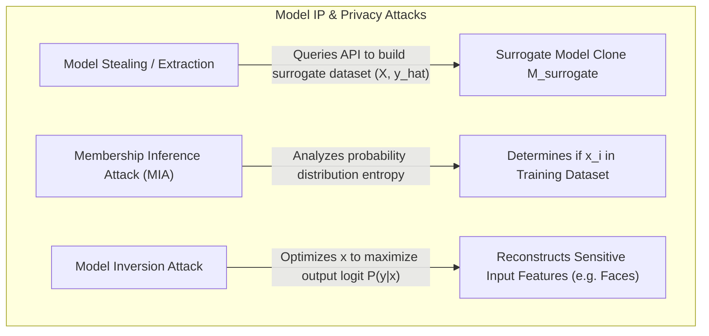
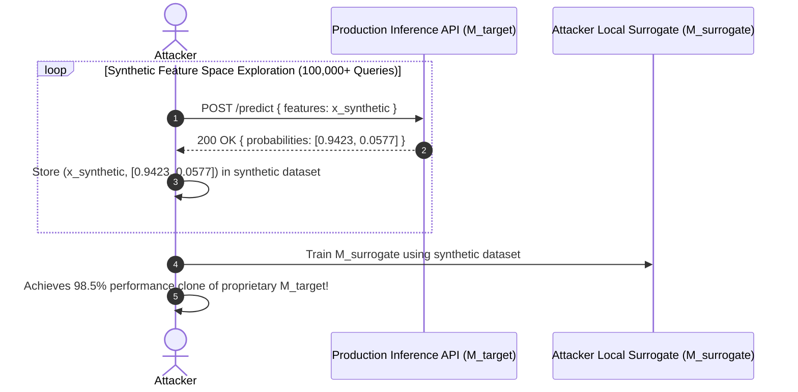

# 04. Model Intellectual Property & Extraction Defense

Machine learning model weights, hyperparameters, and proprietary architectures represent significant financial and intellectual property investments. Once deployed to production APIs, models face threats targeting both their **intellectual property** (Model Extraction) and the **privacy of their underlying training data** (Membership Inference & Model Inversion).

---

## 1. Intellectual Property & Privacy Threat Vectors



### A. Model Stealing / Extraction (Tramèr et al.)
In a model extraction attack, an adversary queries a black-box machine learning API with systematically selected inputs `X = \{x_1, x_2, \dots, x_N\}` and records the model's output probabilities or predictions `\hat{y} = M_{target}(X)`. 

The adversary then uses the synthetic dataset `(X, \hat{y})` to train a local surrogate model `M_{surrogate}`:

```
\min_{\theta_{surrogate}} \sum_{i=1}^N \mathcal{L}\left( M_{surrogate}(x_i; \theta_{surrogate}), M_{target}(x_i) \right)
```

The resulting clone achieves comparable performance to the target model at a fraction of the original training cost, completely bypassing IP protections.



### B. Membership Inference Attacks (MIA) (Shokri et al.)
Membership inference attacks attempt to determine whether a specific individual's data record `x_i` was used in training `M_{target}`.
- **Root Cause**: Models tend to yield higher confidence scores (lower prediction entropy) and lower loss values on training samples compared to unseen validation samples (overfitting).
- **Mechanism**: The attacker trains an adversarial shadow model to distinguish between confidence distribution patterns of "member" vs "non-member" samples.

### C. Model Inversion & Feature Reconstruction
Model inversion attacks exploit gradient access or fine-grained probability outputs to reverse-engineer training inputs. By computing gradient updates that maximize the prediction probability of a target class `y_{target}`, the attack reconstructs sensitive visual or tabular features (e.g., facial images from a facial recognition classifier).

---

## 2. Production Defense Strategies

### Defense Matrix

| Protection Mechanism | Threat Target | Mechanism | Implementation Trade-off |
|---|---|---|---|
| **Prediction Response Hardening** | Model Extraction & MIA | Truncate probabilities to Top-1 class integer, round floats, or add logit noise. | Minor reduction in client confidence insight; zero impact on top-1 accuracy. |
| **Query Entropy Throttling** | Model Extraction | Track client query distribution in feature space; throttle out-of-distribution sweeps. | Requires stateful tracking in API Gateway. |
| **Differential Privacy (DP-SGD)** | MIA & Model Inversion | Clip gradients and add Gaussian noise during model training. | Mathematical privacy guarantee (`\epsilon, \delta`); minor impact on model utility. |
| **Model Watermarking** | Intellectual Property Theft | Embed secret trigger pairs (radioactive data) or weight signatures. | Proves stolen model origin in legal disputes; zero operational overhead. |

---

## 3. Code Implementations: PyTorch, FastAPI, Node.js

### A. Differential Privacy Training with PyTorch Opacus (Python)

To guarantee differential privacy and eliminate Membership Inference risks, train the model using **`DP-SGD`** (Differentially Private Stochastic Gradient Descent) via the `opacus` library:

```python
# dp_training.py
import torch
import torch.nn as nn
import torch.optim as optim
from opacus import PrivacyEngine

def train_differentially_private_model(
    model: nn.Module, 
    train_loader: torch.utils.data.DataLoader, 
    epochs: int = 5,
    target_epsilon: float = 3.0,
    target_delta: float = 1e-5
) -> nn.Module:
    """
    Trains PyTorch model with DP-SGD providing provable (epsilon, delta) differential privacy bounds.
    """
    optimizer = optim.Adam(model.parameters(), lr=0.001)
    criterion = nn.CrossEntropyLoss()
    
    # Attach Opacus Privacy Engine
    privacy_engine = PrivacyEngine()
    model, optimizer, train_loader = privacy_engine.make_private_with_epsilon(
        module=model,
        optimizer=optimizer,
        data_loader=train_loader,
        epochs=epochs,
        target_epsilon=target_epsilon,
        target_delta=target_delta,
        max_grad_norm=1.0, # Gradient clipping bound
    )
    
    model.train()
    for epoch in range(epochs):
        for x_batch, y_batch in train_loader:
            optimizer.zero_grad()
            outputs = model(x_batch)
            loss = criterion(outputs, y_batch)
            loss.backward()
            optimizer.step()
            
        epsilon = privacy_engine.get_epsilon(target_delta)
        print(f"Epoch {epoch+1}/{epochs} Completed | Spent DP Budget (Epsilon): {epsilon:.2f}")
        
    return model
```

### B. Secure Inference API with Response Hardening & FastAPI (Python)

```python
# secure_inference_api.py
from fastapi import FastAPI, HTTPException, Request, Depends
import numpy as np
import torch
import torch.nn as nn
from typing import Dict, Any

app = FastAPI(title="Hardened Secure Inference API")

# Hardened Model Wrapper
class SecureInferenceEngine:
    def __init__(self, model: nn.Module):
        self.model = model
        self.model.eval()

    def predict_hardened(self, input_tensor: torch.Tensor, return_full_probabilities: bool = False) -> Dict[str, Any]:
        with torch.no_grad():
            logits = self.model(input_tensor)
            probabilities = torch.softmax(logits, dim=1).numpy()[0]
            
            top_class = int(np.argmax(probabilities))
            top_confidence = float(np.max(probabilities))
            
            # Defense Step 1: Return Top-1 prediction only (Hard Labeling)
            if not return_full_probabilities:
                return {
                    "class_id": top_class,
                    "confidence_label": "HIGH" if top_confidence > 0.8 else "MEDIUM"
                }

            # Defense Step 2: Response Hardening (Probability Truncation & Noise Injection)
            rounded_prob = round(top_confidence, 2)
            # Add subtle Laplace noise to defeat differential model inversion
            noisy_prob = rounded_prob + np.random.laplace(0, 0.01)
            noisy_prob = float(np.clip(noisy_prob, 0.0, 1.0))

            return {
                "class_id": top_class,
                "confidence": round(noisy_prob, 2)
            }

# Instantiate Engine (Dummy PyTorch model for illustration)
dummy_model = nn.Sequential(nn.Linear(10, 2))
engine = SecureInferenceEngine(dummy_model)

@app.post("/api/v1/predict")
async def predict(request_data: Dict[str, Any]):
    try:
        features = torch.tensor([request_data["features"]], dtype=torch.float32)
        response = engine.predict_hardened(features, return_full_probabilities=False)
        return response
    except Exception as e:
        raise HTTPException(status_code=400, detail="Invalid request feature format.")
```

### C. Model Watermarking with Trigger Verification (Python)

```python
# model_watermark.py
import torch
import torch.nn as nn
import torch.optim as optim

class ModelWatermarker:
    """
    Embeds radioactive trigger pairs into model weights during training to prove IP ownership.
    """
    def __init__(self, watermark_key: torch.Tensor, target_class: int):
        self.watermark_key = watermark_key # Secret trigger sample
        self.target_class = target_class

    def inject_watermark(self, model: nn.Module, epochs: int = 3):
        optimizer = optim.Adam(model.parameters(), lr=0.0001)
        criterion = nn.CrossEntropyLoss()
        target_tensor = torch.tensor([self.target_class])

        model.train()
        for _ in range(epochs):
            optimizer.zero_grad()
            output = model(self.watermark_key)
            loss = criterion(output, target_tensor)
            loss.backward()
            optimizer.step()
            
        print("✅ Watermark successfully embedded into model weights.")

    def verify_ownership(self, suspect_model: nn.Module) -> bool:
        suspect_model.eval()
        with torch.no_grad():
            output = suspect_model(self.watermark_key)
            predicted_class = torch.argmax(output).item()
            
        is_stolen = (predicted_class == self.target_class)
        if is_stolen:
            print("🚨 WATERMARK MATCH: Model contains secret trigger pair! Ownership verified.")
        return is_stolen
```

### D. Express.js Synthetic Query Throttler (Node.js)

```typescript
// queryThrottler.ts
import { Request, Response, NextFunction } from 'express';

interface ClientQueryStats {
  queryCount: number;
  firstQueryTimestamp: number;
  featureEntropySum: number;
}

const clientStore = new Map<string, ClientQueryStats>();
const QUERY_WINDOW_MS = 60 * 1000; // 1 Minute
const MAX_QUERIES_PER_WINDOW = 50;  // Threshold for model stealing sweeps

export function modelExtractionGuard(req: Request, res: Response, next: NextFunction) {
  const clientId = req.ip || (req.headers['x-api-key'] as string);
  const now = Date.now();

  let stats = clientStore.get(clientId);

  if (!stats || (now - stats.firstQueryTimestamp) > QUERY_WINDOW_MS) {
    stats = {
      queryCount: 1,
      firstQueryTimestamp: now,
      featureEntropySum: 0
    };
    clientStore.set(clientId, stats);
    return next();
  }

  stats.queryCount++;

  // Detect query flooding indicative of Model Extraction sweeps
  if (stats.queryCount > MAX_QUERIES_PER_WINDOW) {
    return res.status(429).json({
      error: "Too Many Requests",
      message: "Query volume exceeds allowable rate limit for inference model. Potential extraction policy violation.",
      retryAfterSeconds: Math.ceil((QUERY_WINDOW_MS - (now - stats.firstQueryTimestamp)) / 1000)
    });
  }

  clientStore.set(clientId, stats);
  next();
}
```

---

*Next Chapter: [05. Automated ML Security Tooling & Evaluation Frameworks →](05-ml-security-tooling-and-art.md)*
