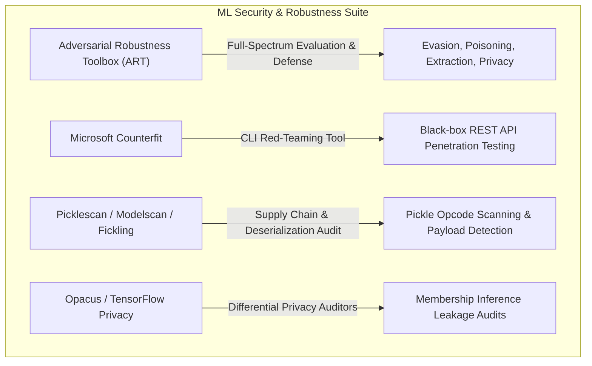
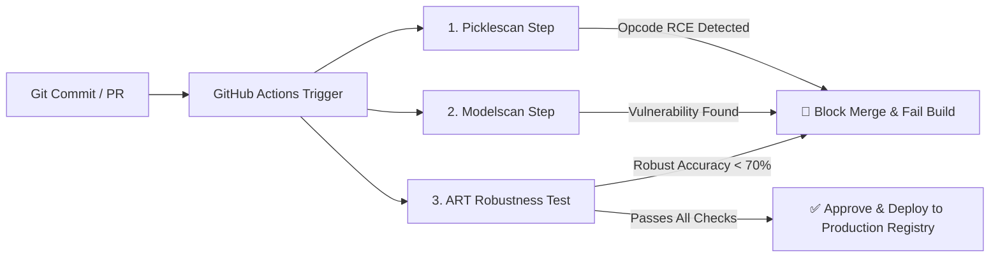

# 05. Automated ML Security Tooling & Evaluation Frameworks

Automating security evaluations across machine learning lifecycles is essential for maintaining production security posture. This chapter covers the enterprise ecosystem of ML security tooling, detailing the setup and execution of the **Linux Foundation Adversarial Robustness Toolbox (ART)**, artifact scanners (`picklescan`, `modelscan`), and CI/CD pipeline automation.

---

## 1. Enterprise ML Security Tooling Suite



### Comparative Tooling Matrix

| Tool | Project / Maintainer | Category | Supported Frameworks | Key Capability |
|---|---|---|---|---|
| **ART** | Linux Foundation | Full Security Framework | PyTorch, TensorFlow, Keras, Scikit-learn, XGBoost | Evasion attacks (FGSM, PGD, C&W), Poisoning detection, Model Extraction audits, Clean-label defense. |
| **Counterfit** | Microsoft Azure | CLI Red-Teaming | REST APIs, ONNX, PyTorch, Custom HTTP endpoints | Automated black-box target auditing, attack surface mapping, payload generation. |
| **Picklescan** | Hugging Face | Supply Chain Scanner | PyTorch (`.pt`, `.bin`), Pickle (`.pkl`) | Detects dangerous Python pickle opcodes (`REDUCE`, `BUILD`, `GLOBAL`) prior to loading. |
| **Modelscan** | Protect AI | Model Artifact Scanner | H5, SavedModel, PyTorch, Joblib | Scans serialized model formats for code execution vulnerabilities in CI/CD pipelines. |
| **Fickling** | Trail of Bits | Static Analyzer & Decompiler | Python Pickle files | Decompiles, analyzes, and injects/detects reverse shell payloads in pickle bytecode. |
| **Foolbox** | Independent | Attack Benchmarking | PyTorch, TensorFlow, JAX | Rapid evaluation of adversarial robustness against `L_0`, `L_2`, `L_\infty` attacks. |

---

## 2. Setting Up & Executing the Linux Foundation ART

### Installation
```bash
# Install Adversarial Robustness Toolbox and PyTorch dependencies
pip install adversarial-robustness-toolbox torch torchvision numpy
```

### Python Automated Security Evaluation Pipeline (`art_audit.py`)

The following production script wraps a PyTorch classifier in an ART Estimator and executes an automated multi-attack audit evaluating **FGSM Evasion**, **HopSkipJump Black-Box Evasion**, and **Membership Inference Leakage**:

```python
# art_security_evaluator.py
import torch
import torch.nn as nn
import torch.optim as optim
import numpy as np

from art.estimators.classification import PyTorchClassifier
from art.attacks.evasion import FastGradientMethod, ProjectedGradientDescent, HopSkipJump
from art.attacks.inference.membership_inference import MembershipInferenceBlackBox

# 1. Define Target Architecture
class ClassifierModel(nn.Module):
    def __init__(self):
        super().__init__()
        self.network = nn.Sequential(
            nn.Linear(20, 64),
            nn.ReLU(),
            nn.Linear(64, 32),
            nn.ReLU(),
            nn.Linear(32, 2)
        )
    def forward(self, x):
        return self.network(x)

def run_art_benchmark():
    model = ClassifierModel()
    criterion = nn.CrossEntropyLoss()
    optimizer = optim.Adam(model.parameters(), lr=0.01)

    # 2. Wrap Model in ART PyTorchClassifier Estimator
    art_classifier = PyTorchClassifier(
        model=model,
        loss=criterion,
        optimizer=optimizer,
        input_shape=(20,),
        nb_classes=2,
        clip_values=(0.0, 1.0) # Feature normalization bounds
    )
    print("✅ Model successfully wrapped with ART Security Estimator.")

    # Generate synthetic dummy evaluation data
    X_test = np.random.uniform(0, 1, size=(100, 20)).astype(np.float32)
    y_test = np.random.randint(0, 2, size=(100,))

    # 3. Evaluate Baseline Accuracy
    baseline_preds = art_classifier.predict(X_test)
    baseline_acc = np.mean(np.argmax(baseline_preds, axis=1) == y_test)
    print(f"📊 Baseline Test Accuracy: {baseline_acc * 100:.2f}%")

    # 4. Execute White-Box FGSM Evasion Benchmark
    print("\n[Audit 1/3] Executing FGSM White-Box Evasion Attack...")
    fgsm = FastGradientMethod(estimator=art_classifier, eps=0.1)
    X_test_fgsm = fgsm.generate(x=X_test)
    
    fgsm_preds = art_classifier.predict(X_test_fgsm)
    fgsm_acc = np.mean(np.argmax(fgsm_preds, axis=1) == y_test)
    print(f"🚨 Robust Accuracy under FGSM (eps=0.1): {fgsm_acc * 100:.2f}%")
    print(f"📉 Accuracy Drop: {(baseline_acc - fgsm_acc) * 100:.2f}%")

    # 5. Execute Black-Box HopSkipJump Evasion Benchmark
    print("\n[Audit 2/3] Executing HopSkipJump Black-Box Evasion Attack...")
    hsj = HopSkipJump(classifier=art_classifier, max_iter=10, max_eval=100)
    X_test_hsj = hsj.generate(x=X_test[:20]) # Evaluate sub-batch for speed
    
    hsj_preds = art_classifier.predict(X_test_hsj)
    hsj_acc = np.mean(np.argmax(hsj_preds, axis=1) == y_test[:20])
    print(f"🚨 Robust Accuracy under Black-Box HopSkipJump: {hsj_acc * 100:.2f}%")

    # 6. Execute Membership Inference Vulnerability Audit
    print("\n[Audit 3/3] Auditing Membership Inference Privacy Risk...")
    mia = MembershipInferenceBlackBox(estimator=art_classifier)
    
    # Train MIA attacker on sub-batch
    mia.fit(X_test[:50], y_test[:50], X_test[50:], y_test[50:])
    inferred_membership = mia.infer(X_test[:20], y_test[:20])
    
    mia_risk_score = np.mean(inferred_membership)
    print(f"🔒 Membership Inference Risk Score: {mia_risk_score * 100:.1f}%")
    
    if mia_risk_score > 0.70:
        print("⚠️ HIGH PRIVACY RISK: Model exhibits strong membership inference leakage! Apply DP-SGD.")

if __name__ == "__main__":
    run_art_benchmark()
```

---

## 3. Supply Chain Security Auditing (`picklescan` & `modelscan`)

### CLI Scanning Commands
Before deploying model weight artifacts to production registries, execute automated artifact security scans:

```bash
# Install model supply chain security auditors
pip install picklescan modelscan

# Scan single PyTorch weights artifact
picklescan -f ./models/checkpoint_epoch_50.pt

# Scan entire model release directory with modelscan
modelscan -d ./models/ --format json -o scan_results.json
```

---

## 4. MLSecOps CI/CD Integration

Integrate automated security gating into GitHub Actions workflows to block insecure model weights and vulnerable architectures prior to production deployment.



### GitHub Actions Pipeline Configuration (`.github/workflows/ml-security-scan.yml`)

```yaml
name: ML Model Security Audit

on:
  push:
    branches: [ main, release/* ]
  pull_request:
    paths:
      - 'models/**'
      - 'pipelines/**'

jobs:
  mlsecops-audit:
    runs-on: ubuntu-latest

    steps:
      - name: Checkout Repository
        uses: actions/checkout@v3

      - name: Set up Python 3.10
        uses: actions/setup-python@v4
        with:
          python-version: '3.10'

      - name: Install ML Security Tooling
        run: |
          python -m pip install --upgrade pip
          pip install picklescan modelscan adversarial-robustness-toolbox torch numpy

      - name: Step 1 - Artifact Deserialization Audit (Picklescan)
        run: |
          echo "🔍 Scanning model artifacts for dangerous pickle opcodes..."
          picklescan --path ./models/

      - name: Step 2 - Comprehensive Artifact Audit (Modelscan)
        run: |
          echo "🔍 Running Modelscan static artifact inspection..."
          modelscan -d ./models/ --fail-on-error

      - name: Step 3 - Automated ART Robustness Benchmark
        run: |
          echo "🧪 Running ART Evasion and Sensitivity Benchmark..."
          python scripts/art_security_evaluator.py
```

---

*Next Chapter: [06. Hands-On Audit Lab →](06-hands-on-lab.md)*
