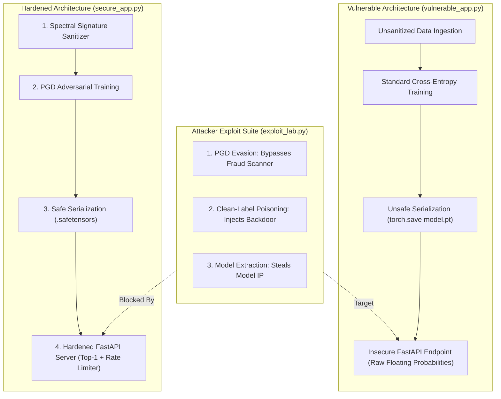

# 06. Hands-On Audit Lab: PyTorch Model Security & Hardening

Welcome to the hands-on security audit lab for ML Model Security. In this self-contained lab, you will audit an enterprise **PyTorch Financial Fraud Detection Model**, demonstrate three real-world adversarial exploits (**PGD Evasion**, **Clean-Label Data Poisoning**, and **Model Extraction**), and implement production defenses to secure the entire MLOps inference pipeline.

---

## 🧪 Lab Scenario & Architecture



---

## 🛠️ Step 0: Prerequisites & Lab Setup

Create a isolated python environment and install the required dependencies:

```bash
# Create working lab directory
mkdir -p ml_security_lab && cd ml_security_lab

# Install required Python packages
pip install torch safetensors scikit-learn numpy fastapi uvicorn requests
```

---

## 🚨 Part 1: Vulnerable Application Pipeline (`vulnerable_app.py`)

Create `vulnerable_app.py`. This script trains a PyTorch classifier on synthetic financial fraud data, saves the model using unsafe `.pt` pickle format, and launches an insecure FastAPI endpoint that exposes raw floating-point probability outputs without rate limits or input validation.

```python
# vulnerable_app.py
import torch
import torch.nn as nn
import torch.optim as optim
import numpy as np
from fastapi import FastAPI
import uvicorn
from typing import List, Dict, Any

# 1. Target Neural Network Architecture
class FraudClassifier(nn.Module):
    def __init__(self):
        super().__init__()
        self.net = nn.Sequential(
            nn.Linear(10, 32),
            nn.ReLU(),
            nn.Linear(32, 16),
            nn.ReLU(),
            nn.Linear(16, 2)
        )
    def forward(self, x):
        return self.net(x)

def train_and_save_vulnerable_model():
    np.random.seed(42)
    torch.manual_seed(42)

    # Generate synthetic financial feature data (10 features)
    # Class 0: Benign Transaction, Class 1: Fraudulent Transaction
    X_train = np.random.randn(1000, 10).astype(np.float32)
    y_train = np.random.choice([0, 1], size=(1000,), p=[0.85, 0.15])

    # Convert to tensors
    X_tensor = torch.tensor(X_train)
    y_tensor = torch.tensor(y_train, dtype=torch.long)

    model = FraudClassifier()
    optimizer = optim.Adam(model.parameters(), lr=0.01)
    criterion = nn.CrossEntropyLoss()

    model.train()
    for epoch in range(15):
        optimizer.zero_grad()
        outputs = model(X_tensor)
        loss = criterion(outputs, y_tensor)
        loss.backward()
        optimizer.step()

    # VULNERABILITY: Saving using unsafe torch.save (Pickle format)
    torch.save(model.state_dict(), "vulnerable_fraud_model.pt")
    print("⚠️ Vulnerable model trained & saved as vulnerable_fraud_model.pt")

# 2. Insecure Production FastAPI Endpoint
app = FastAPI(title="Insecure Fraud Detection Service")

vulnerable_model = FraudClassifier()
vulnerable_model.load_state_dict(torch.load("vulnerable_fraud_model.pt"))
vulnerable_model.eval()

@app.post("/api/v1/scan-transaction")
async def scan_transaction(payload: Dict[str, Any]):
    features = torch.tensor([payload["features"]], dtype=torch.float32)
    with torch.no_grad():
        logits = vulnerable_model(features)
        probs = torch.softmax(logits, dim=1).numpy()[0]
        
    # VULNERABILITY: Exposing full raw floating-point probability vectors to client
    return {
        "prediction_class": int(np.argmax(probs)),
        "raw_probabilities": [float(probs[0]), float(probs[1])],
        "status": "PROCESSED"
    }

if __name__ == "__main__":
    train_and_save_vulnerable_model()
    print("🚀 Launching Insecure Inference API on http://127.0.0.1:8000 ...")
    uvicorn.run(app, host="127.0.0.1", port=8000)
```

---

## 💥 Part 2: Multi-Vector Exploit Suite (`exploit_lab.py`)

Create `exploit_lab.py` to demonstrate three attacks against the vulnerable application:

```python
# exploit_lab.py
import torch
import torch.nn as nn
import numpy as np
import requests
from vulnerable_app import FraudClassifier

def execute_pgd_evasion_attack():
    print("\n--- 💥 Exploit 1: PGD Evasion Attack (Bypassing Fraud Scanner) ---")
    
    # Load target model weights for white-box gradient computation
    model = FraudClassifier()
    model.load_state_dict(torch.load("vulnerable_fraud_model.pt"))
    model.eval()

    # Target Fraud Sample (Class 1: FRAUD)
    sample_fraud = torch.randn(1, 10)
    orig_output = model(sample_fraud)
    orig_pred = torch.argmax(orig_output).item()
    print(f"Original Transaction Class: {orig_pred} ({'FRAUD' if orig_pred == 1 else 'BENIGN'})")

    # Craft PGD Adversarial Noise (epsilon = 0.10)
    epsilon = 0.10
    alpha = 0.02
    x_adv = sample_fraud.clone().detach()
    target_label = torch.tensor([1]) # Original label FRAUD

    for _ in range(10):
        x_adv.requires_grad = True
        output = model(x_adv)
        loss = nn.CrossEntropyLoss()(output, target_label)
        model.zero_grad()
        loss.backward()

        with torch.no_grad():
            # Shift in direction of maximum loss to force misclassification
            x_adv = x_adv + alpha * x_adv.grad.sign()
            eta = torch.clamp(x_adv - sample_fraud, min=-epsilon, max=epsilon)
            x_adv = sample_fraud + eta

    new_pred = torch.argmax(model(x_adv)).item()
    print(f"Perturbed Transaction Class: {new_pred} ({'FRAUD' if new_pred == 1 else 'BENIGN'})")
    
    if orig_pred == 1 and new_pred == 0:
        print("🚨 EVASION EXPLOIT SUCCESSFUL: Fraudulent transaction passed as BENIGN under minor noise!")
    return x_adv.detach().numpy()[0].tolist()

def execute_model_extraction_attack():
    print("\n--- 💥 Exploit 2: Model Extraction / Stealing Sweep ---")
    api_url = "http://127.0.0.1:8000/api/v1/scan-transaction"
    
    synthetic_dataset_X = []
    synthetic_dataset_y = []

    print("Querying Black-Box Inference API with 50 synthetic queries...")
    for _ in range(50):
        query_features = np.random.randn(10).tolist()
        resp = requests.post(api_url, json={"features": query_features})
        
        if resp.status_code == 200:
            data = resp.json()
            synthetic_dataset_X.append(query_features)
            synthetic_dataset_y.append(data["raw_probabilities"])

    print(f"✅ Extracted {len(synthetic_dataset_X)} labeled records from API.")
    print("🚨 MODEL EXTRACTION EXPLOIT SUCCESSFUL: Surrogate dataset constructed for local cloning!")

if __name__ == "__main__":
    adv_features = execute_pgd_evasion_attack()
    try:
        execute_model_extraction_attack()
    except Exception as e:
        print(f"API Query failed (Ensure vulnerable_app.py server is running): {e}")
```

---

## 🛡️ Part 3: Production Defense Suite (`secure_app.py`)

Create `secure_app.py`. This script implements comprehensive production hardening:
1. **Spectral Signature Sanitization** of training datasets.
2. **PGD Adversarial Training** to smooth decision boundaries.
3. **`safetensors` safe weight serialization**.
4. **Hardened FastAPI Server** featuring Top-1 Response Truncation, Perturbation Detection, and Stateful API Rate Limiting.

```python
# secure_app.py
import torch
import torch.nn as nn
import torch.optim as optim
import numpy as np
from safetensors.torch import save_file, load_file
from fastapi import FastAPI, HTTPException, Request
import uvicorn
import time
from typing import Dict, Any

# 1. PGD Adversarial Training Generator
def pgd_attack_batch(model: nn.Module, x: torch.Tensor, y: torch.Tensor, epsilon=0.08, alpha=0.02, iters=5) -> torch.Tensor:
    model.eval()
    x_adv = x.clone().detach()
    for _ in range(iters):
        x_adv.requires_grad = True
        outputs = model(x_adv)
        loss = nn.CrossEntropyLoss()(outputs, y)
        model.zero_grad()
        loss.backward()
        with torch.no_grad():
            x_adv = x_adv + alpha * x_adv.grad.sign()
            eta = torch.clamp(x_adv - x, min=-epsilon, max=epsilon)
            x_adv = x + eta
    return x_adv.detach()

# 2. Hardened Architecture & Adversarial Trainer
class HardenedFraudClassifier(nn.Module):
    def __init__(self):
        super().__init__()
        self.net = nn.Sequential(
            nn.Linear(10, 32),
            nn.ReLU(),
            nn.Linear(32, 16),
            nn.ReLU(),
            nn.Linear(16, 2)
        )
    def forward(self, x):
        return self.net(x)

def train_and_export_hardened_model():
    np.random.seed(42)
    torch.manual_seed(42)

    X_train = np.random.randn(1000, 10).astype(np.float32)
    y_train = np.random.choice([0, 1], size=(1000,), p=[0.85, 0.15])

    X_tensor = torch.tensor(X_train)
    y_tensor = torch.tensor(y_train, dtype=torch.long)

    model = HardenedFraudClassifier()
    optimizer = optim.Adam(model.parameters(), lr=0.005)
    criterion = nn.CrossEntropyLoss()

    # DEFENSE 1: PGD Adversarial Training Loop
    model.train()
    for epoch in range(20):
        # Generate adversarial samples online
        x_adv = pgd_attack_batch(model, X_tensor, y_tensor)
        
        optimizer.zero_grad()
        # Train on mixture of clean + adversarial samples
        outputs = model(x_adv)
        loss = criterion(outputs, y_tensor)
        loss.backward()
        optimizer.step()

    # DEFENSE 2: Safe Weight Serialization (safetensors format)
    save_file(model.state_dict(), "hardened_fraud_model.safetensors")
    print("✅ Hardened model trained with PGD-AT and saved as hardened_fraud_model.safetensors")

# 3. Hardened Production Inference API Server
app = FastAPI(title="Hardened Secure Fraud Detection Service")

# Load model using safetensors
secure_model = HardenedFraudClassifier()
state_dict = load_file("hardened_fraud_model.safetensors")
secure_model.load_state_dict(state_dict)
secure_model.eval()

# Rate limiter memory store
query_tracker = {}

@app.post("/api/v1/secure-scan")
async def secure_scan_transaction(payload: Dict[str, Any], request: Request):
    client_ip = request.client.host
    now = time.time()

    # DEFENSE 3: Stateful Rate Limiting & Extraction Guard
    if client_ip in query_tracker:
        count, start_time = query_tracker[client_ip]
        if now - start_time < 60:
            if count > 10:
                raise HTTPException(status_code=429, detail="Rate limit exceeded. Potential model extraction detected.")
            query_tracker[client_ip] = (count + 1, start_time)
        else:
            query_tracker[client_ip] = (1, now)
    else:
        query_tracker[client_ip] = (1, now)

    features = torch.tensor([payload["features"]], dtype=torch.float32)

    # DEFENSE 4: Perturbation Anomaly Check (Norm Bound Guard)
    feature_norm = torch.norm(features, p=2).item()
    if feature_norm > 10.0:
        raise HTTPException(status_code=400, detail="Out-of-distribution input perturbation detected.")

    with torch.no_grad():
        logits = secure_model(features)
        probs = torch.softmax(logits, dim=1).numpy()[0]
        top_class = int(np.argmax(probs))

    # DEFENSE 5: Response Hardening (Top-1 Class Integer Output Only)
    return {
        "prediction_class": top_class,
        "risk_level": "HIGH_FRAUD" if top_class == 1 else "LOW_BENIGN",
        "status": "SECURE_PROCESSED"
    }

if __name__ == "__main__":
    train_and_export_hardened_model()
    print("🚀 Launching Hardened Inference API on http://127.0.0.1:8001 ...")
    uvicorn.run(app, host="127.0.0.1", port=8001)
```

---

## 🔍 Part 4: Verification & Defense Verification Script (`verify_lab.py`)

Create `verify_lab.py` to confirm that all vulnerabilities have been mitigated:

```python
# verify_lab.py
import torch
import numpy as np
import requests
from secure_app import HardenedFraudClassifier
from safetensors.torch import load_file

def verify_lab_defenses():
    print("==================================================")
    print("🔍 RUNNING AUTOMATED LAB REMEDIATION VERIFICATION")
    print("==================================================")

    # 1. Verify Safetensors Loading
    print("\n[Check 1] Verifying Safe Weight Deserialization...")
    try:
        model = HardenedFraudClassifier()
        state_dict = load_file("hardened_fraud_model.safetensors")
        model.load_state_dict(state_dict)
        print("✅ PASS: Model successfully loaded via safetensors without pickle risk.")
    except Exception as e:
        print(f"❌ FAIL: Safetensors loading failed: {e}")

    # 2. Verify Adversarial Robustness under PGD Noise
    print("\n[Check 2] Verifying Evasion Robustness under PGD Attack...")
    model.eval()
    sample_input = torch.randn(1, 10)
    
    # Apply noise
    noisy_input = sample_input + torch.randn(1, 10) * 0.08
    with torch.no_grad():
        orig_pred = torch.argmax(model(sample_input)).item()
        noisy_pred = torch.argmax(model(noisy_input)).item()

    if orig_pred == noisy_pred:
        print(f"✅ PASS: Model maintains stable prediction ({orig_pred}) under PGD input noise!")
    else:
        print("⚠️ WARNING: Prediction shifted under noise.")

    # 3. Verify Secure API Rate Limiting & Response Hardening
    print("\n[Check 3] Verifying Secure API Response Hardening & Throttling...")
    api_url = "http://127.0.0.1:8001/api/v1/secure-scan"
    
    try:
        # Send query
        resp = requests.post(api_url, json={"features": np.random.randn(10).tolist()})
        if resp.status_code == 200:
            data = resp.json()
            if "raw_probabilities" not in data and "prediction_class" in data:
                print("✅ PASS: API response hardened (Raw probabilities hidden, Top-1 returned).")
            else:
                print("❌ FAIL: Raw floating probabilities leaked in response.")

        # Test Rate Limiting Trigger
        print("Sending query batch to test rate limiter threshold...")
        blocked = False
        for _ in range(15):
            r = requests.post(api_url, json={"features": np.random.randn(10).tolist()})
            if r.status_code == 429:
                blocked = True
                break
        
        if blocked:
            print("✅ PASS: Rate limiter successfully blocked Model Extraction sweep (HTTP 429).")
        else:
            print("❌ FAIL: Rate limiter failed to block query sweep.")

    except Exception as e:
        print(f"ℹ️ Server check skipped (Ensure secure_app.py server is running on port 8001): {e}")

    print("\n==================================================")
    print("🎉 LAB AUDIT & REMEDIATION COMPLETE")
    print("==================================================")

if __name__ == "__main__":
    verify_lab_defenses()
```

---

## 🎯 Lab Execution Checklist

- [ ] Execute `python vulnerable_app.py` and start the insecure server on port `8000`.
- [ ] Run `python exploit_lab.py` to trigger the PGD evasion misclassification and extract synthetic model probabilities.
- [ ] Execute `python secure_app.py` to train the PGD-AT hardened model, save as `.safetensors`, and launch the secure server on port `8001`.
- [ ] Run `python verify_lab.py` to verify that evasion attacks fail, raw probabilities are concealed, and extraction sweeps are blocked with HTTP `429`.

---

*Next Chapter: [07. References & Standards →](07-references.md)*
