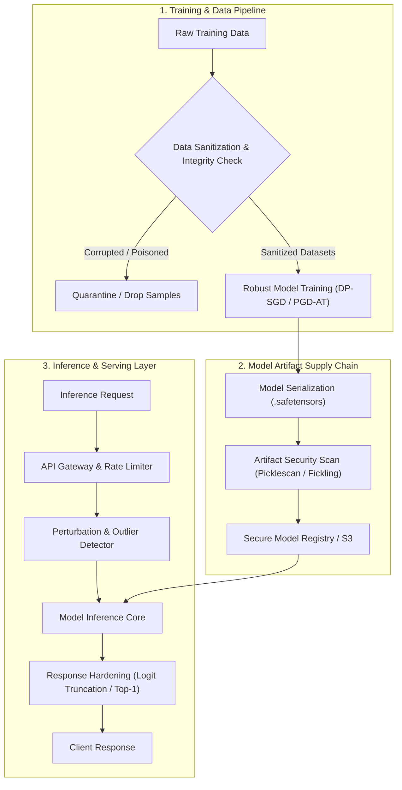

# ML Model Security & Adversarial Attacks Guide

> **Section:** 🤖 AI/ML Security  
> **Level:** Advanced  
> **Time to Complete:** ~90 minutes  
> **Prerequisites:** Python 3.10+, PyTorch or TensorFlow fundamentals, basic linear algebra & calculus  
> **Status:** ✅ Complete & Production-Ready

---

## 🎯 Overview & Learning Objectives

Machine Learning Model Security focuses on evaluating, auditing, and hardening predictive algorithms, deep neural networks, and MLOps pipelines against hostile adversarial environments. Unlike traditional software security, which focuses on discrete memory boundaries and syntax errors, **ML model security operates on continuous mathematical spaces, high-dimensional gradient fields, and statistical data distributions**.

By the end of this practical guide, you will be able to:
- [x] **Analyze** the Adversarial ML threat taxonomy per **NIST AI 100-2** and **MITRE ATLAS™**.
- [x] **Evaluate** neural network sensitivity to adversarial input noise (`L_0`, `L_2`, `L_\infty` bounds) using PyTorch and TensorFlow.
- [x] **Implement** mathematical evasion attacks (FGSM, PGD, C&W) and robust adversarial training defenses.
- [x] **Detect & Sanitize** clean-label data poisoning, Trojan backdoors, and corrupted training datasets using Spectral Signatures and Activation Clustering.
- [x] **Protect** proprietary model weights and intellectual property against model stealing (extraction), membership inference, and model inversion via differential privacy (`DP-SGD`) and secure inference API wrappers.
- [x] **Mitigate** ML supply chain risks including pickle deserialization exploits using `safetensors`, `picklescan`, and `fickling`.
- [x] **Automate** security auditing with the **Linux Foundation Adversarial Robustness Toolbox (ART)** and CI/CD artifact scanning.
- [x] **Execute** a comprehensive hands-on laboratory audit of a PyTorch inference application from vulnerability identification to production remediation.

---

## 🏗️ ML Model Security Architecture

---

## 📚 Module Navigation

1. **[01. Overview & Adversarial ML Threat Landscape](01-introduction.md)** — Core principles, threat taxonomy, NIST AI 100-2, MITRE ATLAS, and pickle supply chain security.
2. **[02. Adversarial Input Robustness & Sensitivity](02-adversarial-robustness-evaluations.md)** — Mathematical mechanics of evasion attacks (FGSM, PGD, C&W, AutoAttack), gradient stability, and adversarial training in PyTorch & TensorFlow.
3. **[03. Data Poisoning & Dataset Sanitization](03-data-poisoning-and-clean-label-sanitization.md)** — Clean-label poisoning, Trojan backdoors, Spectral Signatures, Activation Clustering, and dataset provenance verification.
4. **[04. Model Intellectual Property & Extraction Defense](04-model-intellectual-property-protection.md)** — Defending against model stealing, membership inference, and model inversion using differential privacy, logit truncation, and model watermarking.
5. **[05. Automated ML Auditing with ART & Security Tools](05-ml-security-tooling-and-art.md)** — Enterprise tooling setup featuring Linux Foundation ART, Microsoft Counterfit, model scanners (`picklescan`, `fickling`), and GitHub Actions pipelines.
6. **[06. Hands-On Audit Lab](06-hands-on-lab.md)** — Comprehensive self-contained lab: PyTorch Model Audit + FGSM/PGD Evasion + Data Poisoning + Robust Adversarial Training + Secure FastAPI Inference Wrapper.
7. **[07. References & Standards](07-references.md)** — Academic benchmarks (RobustBench), NIST guidelines, MITRE ATLAS mapping, and open-source security toolkits.

---

*Begin reading: [01. Overview & Adversarial ML Threat Landscape →](01-introduction.md)*
