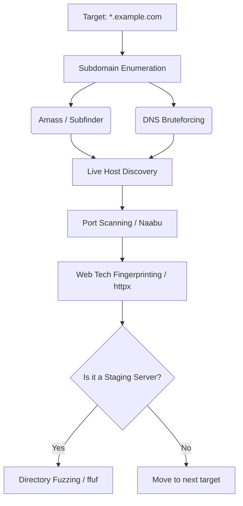

# 01 - Reconnaissance & Asset Discovery

## 1. The Concept (ELI5)
Imagine you are trying to find a way into a massive medieval castle. Most people only look at the heavily guarded front gate (the main website). Reconnaissance is like walking around the entire perimeter of the castle, finding a loose stone in the wall, an unguarded servant's entrance, or an old forgotten tunnel (subdomains, exposed APIs, staging environments). The wider you cast your net, the higher your chances of finding a vulnerability.

## 2. The Visual


## 3. The Code
Here is what a vulnerable exposed debugging endpoint looks like vs a secure production configuration.

### Vulnerable Code ❌
```python
# Python (Flask)
from flask import Flask, request

app = Flask(__name__)

@app.route('/debug')
def debug_info():
    # EXPOSED: Leaking internal environment variables
    import os
    return str(os.environ)
```

```go
// Go
package main
import (
    "net/http"
    "os"
)
func debugHandler(w http.ResponseWriter, r *http.Request) {
    // EXPOSED to public
    w.Write([]byte(os.Getenv("AWS_SECRET_ACCESS_KEY")))
}
```

```typescript
// TypeScript (Express)
import express from 'express';
const app = express();

app.get('/api/internal/stats', (req, res) => {
    // Missing auth middleware
    res.json({ users: 5000, db_status: "online" });
});
```

### Production-Ready Secure Code ✅
```python
# Python
@app.route('/debug')
@admin_required
def debug_info():
    return "Secure metrics endpoint."
```

```go
// Go
func debugHandler(w http.ResponseWriter, r *http.Request) {
    if !isAuthorized(r) {
        http.Error(w, "Forbidden", http.StatusForbidden)
        return
    }
    // safe metrics
}
```

```typescript
// TypeScript
app.get('/api/internal/stats', requireRole('admin'), (req, res) => {
    res.json({ users: 5000, db_status: "online" });
});
```

## 4. The Guardrail
Use Semgrep to catch exposed debug endpoints:
```yaml
rules:
  - id: exposed-flask-debug
    patterns:
      - pattern: |
          @app.route("...")
          def $FUNC(...):
              ...
              return os.environ
    message: "Exposed environment variables in route."
    severity: ERROR
    languages: [python]
```
