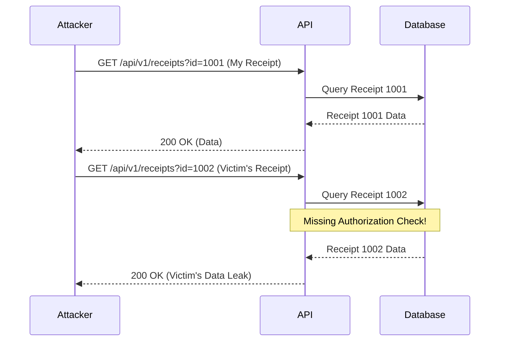

# 02 - Authentication & Authorization Flaws

## 1. The Concept (ELI5)
Imagine a hotel where every room has a lock (Authentication - you proved who you are to get a keycard). But what if your keycard accidentally works on every single door in the hotel? That is Broken Access Control (Authorization flaw - you are allowed into places you shouldn't be). In web apps, this often manifests as Insecure Direct Object References (IDOR), where simply changing a user ID in the URL gives you access to someone else's private data.

## 2. The Visual


## 3. The Code

### Vulnerable Code ❌
```python
# Python
@app.route('/api/user/<int:user_id>')
def get_user(user_id):
    # VULNERABLE: No check if current_user.id == user_id
    user = db.session.query(User).get(user_id)
    return jsonify(user.to_dict())
```

```go
// Go
func getUser(w http.ResponseWriter, r *http.Request) {
    userID := r.URL.Query().Get("id")
    // VULNERABLE: Directly fetching based on input
    user := fetchUserFromDB(userID)
    json.NewEncoder(w).Encode(user)
}
```

```typescript
// TypeScript
app.get('/api/document/:docId', async (req, res) => {
    // VULNERABLE: Anyone can fetch any docId
    const doc = await Document.findById(req.params.docId);
    res.json(doc);
});
```

### Production-Ready Secure Code ✅
```python
# Python
@app.route('/api/user/<int:user_id>')
@login_required
def get_user(user_id):
    if current_user.id != user_id and not current_user.is_admin:
        abort(403)
    user = db.session.query(User).get(user_id)
    return jsonify(user.to_dict())
```

```go
// Go
func getUser(w http.ResponseWriter, r *http.Request) {
    userID := r.URL.Query().Get("id")
    sessionUser := getSessionUser(r)
    
    if sessionUser.ID != userID {
        http.Error(w, "Forbidden", http.StatusForbidden)
        return
    }
    user := fetchUserFromDB(userID)
    json.NewEncoder(w).Encode(user)
}
```

```typescript
// TypeScript
app.get('/api/document/:docId', requireAuth, async (req, res) => {
    const doc = await Document.findOne({ 
        _id: req.params.docId, 
        ownerId: req.user.id 
    });
    if (!doc) return res.status(404).send('Not found');
    res.json(doc);
});
```

## 4. The Guardrail
```yaml
rules:
  - id: prevent-idor-express
    patterns:
      - pattern: Model.findById(req.params.$ID)
    message: "Potential IDOR: Fetching object by ID without checking ownership."
    severity: WARNING
    languages: [javascript, typescript]
```
