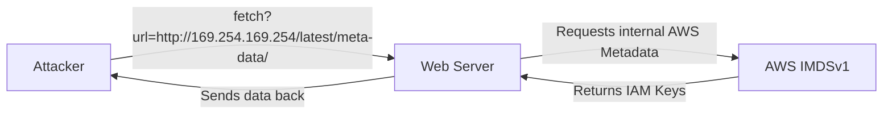

# 03 - Server-Side Request Forgery (SSRF)

## 1. The Concept (ELI5)
Imagine you are not allowed to enter the bank vault, but the bank manager is. If you trick the bank manager into going into the vault, taking a picture of the money, and sending it to you, you've successfully pulled off SSRF. You tricked the server (the manager) into making a request on your behalf to an internal resource (the vault) that you couldn't access directly.

## 2. The Visual


## 3. The Code

### Vulnerable Code ❌
```python
# Python
import requests
@app.route('/proxy')
def proxy():
    url = request.args.get('url')
    # VULNERABLE: Blindly fetching user-supplied URL
    return requests.get(url).content
```

```go
// Go
func proxyHandler(w http.ResponseWriter, r *http.Request) {
    url := r.URL.Query().Get("url")
    // VULNERABLE
    resp, _ := http.Get(url)
    body, _ := ioutil.ReadAll(resp.Body)
    w.Write(body)
}
```

```typescript
// TypeScript
import axios from 'axios';
app.get('/fetch-image', async (req, res) => {
    const { url } = req.query;
    // VULNERABLE
    const response = await axios.get(url as string);
    res.send(response.data);
});
```

### Production-Ready Secure Code ✅
```python
# Python
from urllib.parse import urlparse
import socket

def is_safe_url(url):
    parsed = urlparse(url)
    if parsed.scheme not in ['http', 'https']: return False
    ip = socket.gethostbyname(parsed.hostname)
    # Check if IP is public, block 10.0.0.0/8, 127.0.0.1, 169.254.169.254, etc.
    return not ipaddress.ip_address(ip).is_private

@app.route('/proxy')
def proxy():
    url = request.args.get('url')
    if not is_safe_url(url): return "Blocked", 403
    return requests.get(url, timeout=3).content
```

```go
// Go
// Implement strict domain safelisting and block internal IP ranges
```

```typescript
// TypeScript
// Use SSRF-protection libraries like 'ssrf-req-filter'
```

## 4. The Guardrail
```yaml
rules:
  - id: python-requests-ssrf
    patterns:
      - pattern: requests.get(request.args.get(...))
    message: "SSRF risk: passing user input directly to requests.get()"
    severity: ERROR
    languages: [python]
```
