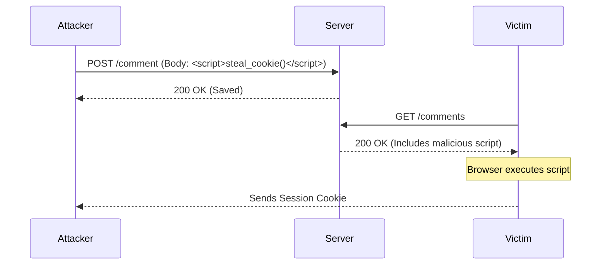

# 04 - Cross-Site Scripting (XSS)

## 1. The Concept (ELI5)
Imagine a bulletin board where anyone can pin a note. Someone pins a note that says "When anyone reads this note, secretly hand me your wallet." If the board doesn't filter out magical commands, people who read the note lose their wallets. XSS is injecting malicious JavaScript into a website so that when other users visit, the script steals their session cookies or performs actions as them.

## 2. The Visual


## 3. The Code

### Vulnerable Code ❌
```python
# Python (Flask/Jinja)
# VULNERABLE: safe filter disables autoescaping
return render_template_string("Hello {{ name | safe }}", name=request.args.get('name'))
```

```go
// Go
// VULNERABLE: template.HTML does not escape
t.Execute(w, template.HTML(r.URL.Query().Get("input")))
```

```typescript
// TypeScript (React)
// VULNERABLE: dangerouslySetInnerHTML
<div dangerouslySetInnerHTML={{ __html: userInput }} />
```

### Production-Ready Secure Code ✅
```python
# Python
# Secure by default (autoescaped)
return render_template_string("Hello {{ name }}", name=request.args.get('name'))
```

```go
// Go
// Secure by default (escapes string)
t.Execute(w, r.URL.Query().Get("input"))
```

```typescript
// TypeScript
// Secure by default
<div>{userInput}</div>
```

## 4. The Guardrail
```yaml
rules:
  - id: react-dangerouslysetinnerhtml
    patterns:
      - pattern: dangerouslySetInnerHTML=...
    message: "Potential XSS via dangerouslySetInnerHTML"
    severity: WARNING
    languages: [javascript, typescript]
```
