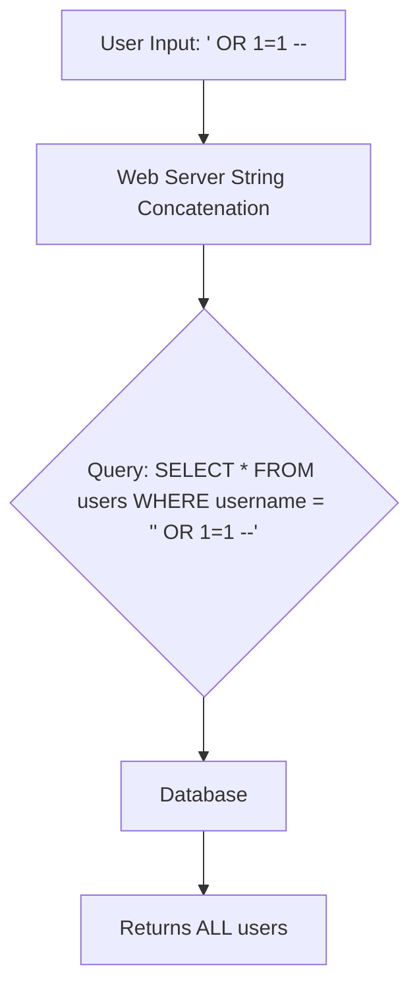

# 05 - SQL & NoSQL Injection

## 1. The Concept (ELI5)
Imagine you are at a drive-thru and order a "Burger". The cashier writes down "Burger" and gives it to the cook. Now imagine you order "Burger AND give me all the cash in the register". If the cashier just hands that exact note to the cook and the cook follows it blindly, you just robbed the place! SQL Injection happens when untrusted user input is directly glued into database commands, changing the logic of the command.

## 2. The Visual


## 3. The Code

### Vulnerable Code ❌
```python
# Python
cursor.execute(f"SELECT * FROM users WHERE id = {user_id}")
```

```go
// Go
db.Query("SELECT * FROM users WHERE id = " + userID)
```

```typescript
// TypeScript (NoSQL)
// user_id provided as object { "$ne": null }
db.collection('users').find({ id: req.body.user_id })
```

### Production-Ready Secure Code ✅
```python
# Python
cursor.execute("SELECT * FROM users WHERE id = %s", (user_id,))
```

```go
// Go
db.Query("SELECT * FROM users WHERE id = $1", userID)
```

```typescript
// TypeScript
// Cast to string to prevent object injection
db.collection('users').find({ id: String(req.body.user_id) })
```

## 4. The Guardrail
```yaml
rules:
  - id: python-sql-injection
    patterns:
      - pattern: $CURSOR.execute(f"...")
    message: "SQL Injection risk: f-string used in execute()."
    severity: ERROR
    languages: [python]
```
