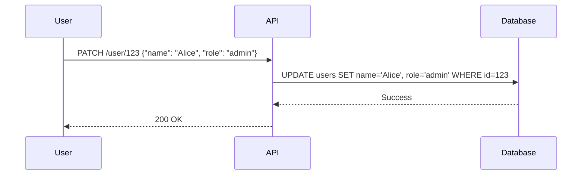

# 06 - API Security & Mass Assignment

## 1. The Concept (ELI5)
Imagine a form to update your profile where you fill in your "Name" and "Email". But you secretly add a field for "Is_Admin: True". The server blindly takes all the fields you sent and updates your profile in the database. Boom, you are an admin. This is Mass Assignment.

## 2. The Visual


## 3. The Code

### Vulnerable Code ❌
```python
# Python
@app.route('/update', methods=['POST'])
def update():
    user = User.query.get(current_user.id)
    # VULNERABLE: Updates all attributes sent in JSON
    for key, value in request.json.items():
        setattr(user, key, value)
    db.session.commit()
```

```go
// Go
// VULNERABLE: Binding all JSON fields to the struct (including internal ones)
json.NewDecoder(r.Body).Decode(&user)
db.Save(&user)
```

```typescript
// TypeScript
// VULNERABLE
Object.assign(user, req.body);
await user.save();
```

### Production-Ready Secure Code ✅
```python
# Python
@app.route('/update', methods=['POST'])
def update():
    user = User.query.get(current_user.id)
    # SECURE: Explicitly allow only certain fields
    allowed = ['name', 'email']
    for key in allowed:
        if key in request.json:
            setattr(user, key, request.json[key])
    db.session.commit()
```

```go
// Go
type UpdateReq struct {
    Name  string `json:"name"`
    Email string `json:"email"`
}
// Decode into the restricted struct first
```

```typescript
// TypeScript
const { name, email } = req.body;
Object.assign(user, { name, email });
await user.save();
```

## 4. The Guardrail
```yaml
rules:
  - id: express-mass-assignment
    patterns:
      - pattern: Object.assign($USER, req.body)
    message: "Mass Assignment risk."
    severity: WARNING
    languages: [javascript, typescript]
```
