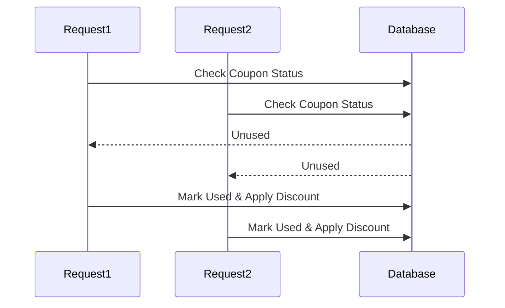

# 07 - Business Logic Flaws & Race Conditions

## 1. The Concept (ELI5)
Imagine you have a coupon for $10 off. You walk up to 5 cashiers at the exact same millisecond and hand them all the same coupon. They all check your account, see you haven't used the coupon, and apply the discount. You just got $50 off! This is a Race Condition. Business logic flaws occur when the application's intended workflow can be bypassed or abused.

## 2. The Visual


## 3. The Code

### Vulnerable Code ❌
```python
# Python
def apply_coupon(user_id, coupon_code):
    coupon = db.query(Coupon).filter_by(code=coupon_code).first()
    if not coupon.is_used: # VULNERABLE TO RACE CONDITION
        user = db.query(User).get(user_id)
        user.balance += coupon.value
        coupon.is_used = True
        db.session.commit()
```

```go
// Go
// VULNERABLE: No mutex or DB lock when checking/updating balance
if user.Balance >= 100 {
    user.Balance -= 100
    dispatchItem()
    db.Save(&user)
}
```

```typescript
// TypeScript
// VULNERABLE: async gap allows race conditions
const account = await Account.findById(req.user.id);
if (account.balance >= withdrawAmount) {
    account.balance -= withdrawAmount;
    await account.save();
}
```

### Production-Ready Secure Code ✅
```python
# Python
# SECURE: Database-level locking (SELECT ... FOR UPDATE)
def apply_coupon(user_id, coupon_code):
    coupon = db.query(Coupon).filter_by(code=coupon_code).with_for_update().first()
    if not coupon.is_used:
        user = db.query(User).get(user_id)
        user.balance += coupon.value
        coupon.is_used = True
        db.session.commit()
```

```go
// Go
// SECURE: Atomic UPDATE operation
db.Exec("UPDATE users SET balance = balance - 100 WHERE id = ? AND balance >= 100", userID)
```

```typescript
// TypeScript
// SECURE: Atomic MongoDB update
const result = await Account.updateOne(
    { _id: req.user.id, balance: { $gte: withdrawAmount } },
    { $inc: { balance: -withdrawAmount } }
);
```

## 4. The Guardrail
```yaml
rules:
  - id: python-missing-db-lock
    patterns:
      - pattern: |
          if $OBJ.is_valid:
              ...
              $OBJ.is_valid = False
              $DB.commit()
    message: "Potential Race Condition: Missing database lock."
    severity: WARNING
    languages: [python]
```
