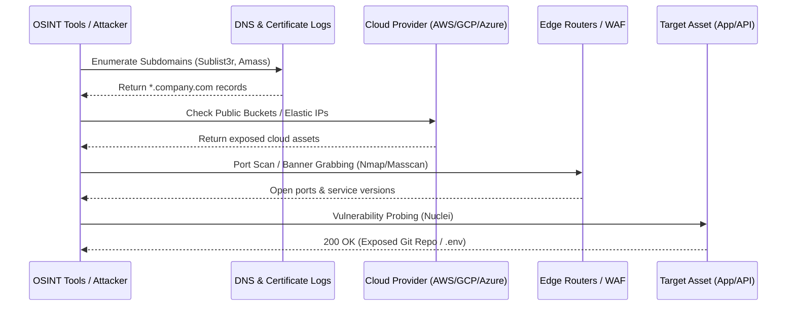

# 01. External Attack Surface Management (EASM)

## 1. The Concept (ELI5)

Imagine you own a massive castle with hundreds of doors, windows, and secret tunnels. As the king, you might only know about the main gate and the back door. But over the years, servants, knights, and builders have added countless other entry points—some of which they forgot to lock, or worse, forgot they even existed. 

In the enterprise world, these "forgotten doors" are your **External Attack Surface**. They are the forgotten APIs, legacy web servers, exposed staging environments, and unpatched VPN gateways. **External Attack Surface Management (EASM)** is the process of continuously mapping the perimeter of the castle from the outside (just like a thief would) to find all the doors, determine which ones are unlocked, and board them up before someone breaks in. It's not just about scanning known assets; it's about discovering the *unknown* assets.

## 2. The Visual

Here is how modern EASM platforms and attackers map an organization's perimeter:



## 3. The Code

Often, external exposure happens because developers accidentally bind services to all interfaces (`0.0.0.0`) instead of `localhost` (`127.0.0.1`), or misconfigure network rules.

### Python (Flask / FastAPI)

❌ **Vulnerable Code: Binding to all interfaces**
```python
from flask import Flask
app = Flask(__name__)

@app.route('/admin-debug')
def debug():
    return "Sensitive internal debug info!"

if __name__ == '__main__':
    # Binds to 0.0.0.0, making the debug port externally accessible
    # if not blocked by a firewall!
    app.run(host='0.0.0.0', port=5000, debug=True)
```

✅ **Production-Ready Secure Code: Local bind & Auth**
```python
from flask import Flask, abort, request
import os

app = Flask(__name__)

@app.route('/admin-debug')
def debug():
    # Adding authorization check even if on internal network
    if request.headers.get("X-Internal-Secret") != os.environ.get("INTERNAL_SECRET"):
        abort(403)
    return "Sensitive internal debug info!"

if __name__ == '__main__':
    # Bind only to localhost, preventing external access
    # Production should use Gunicorn/uWSGI behind a reverse proxy
    app.run(host='127.0.0.1', port=5000, debug=False)
```

### Node.js (Express)

❌ **Vulnerable Code**
```javascript
const express = require('express');
const app = express();

app.get('/metrics', (req, res) => {
    res.json({ users: 500, revenue: 100000 });
});

// Binding to all interfaces without restriction
app.listen(8080, '0.0.0.0', () => {
    console.log('Metrics server running');
});
```

✅ **Production-Ready Secure Code**
```javascript
const express = require('express');
const app = express();

app.get('/metrics', (req, res) => {
    res.json({ users: 500, revenue: 100000 });
});

// Bind to localhost for internal scraping (e.g., Prometheus)
app.listen(8080, '127.0.0.1', () => {
    console.log('Metrics server running securely on localhost');
});
```

### Go

❌ **Vulnerable Code**
```go
package main

import (
	"net/http"
)

func main() {
	http.HandleFunc("/pprof", func(w http.ResponseWriter, r *http.Request) {
		w.Write([]byte("Memory dump..."))
	})
	// Listens on all interfaces
	http.ListenAndServe(":8080", nil)
}
```

✅ **Production-Ready Secure Code**
```go
package main

import (
	"log"
	"net/http"
	"time"
)

func main() {
	mux := http.NewServeMux()
	mux.HandleFunc("/pprof", func(w http.ResponseWriter, r *http.Request) {
		w.Write([]byte("Memory dump..."))
	})

	server := &http.Server{
		Addr:         "127.0.0.1:8080", // Localhost only
		Handler:      mux,
		ReadTimeout:  5 * time.Second,
		WriteTimeout: 10 * time.Second,
		IdleTimeout:  120 * time.Second,
	}

	log.Fatal(server.ListenAndServe())
}
```

## 4. The Guardrail

To prevent internal or sensitive resources from being exposed to the internet, we enforce Network Security Group (NSG) rules via Terraform to ensure SSH/RDP/Internal APIs are never open to `0.0.0.0/0`.

### Terraform (AWS Security Group Check)
This Terraform code securely provisions a security group, ensuring port 22 is NOT open to the world.

```hcl
resource "aws_security_group" "internal_api_sg" {
  name        = "internal_api_sg"
  description = "Security group for internal APIs"
  vpc_id      = aws_vpc.main.id

  # ✅ Secure: Only allow inbound traffic from the corporate VPC CIDR
  ingress {
    from_port   = 443
    to_port     = 443
    protocol    = "tcp"
    cidr_blocks = [aws_vpc.main.cidr_block]
  }

  egress {
    from_port   = 0
    to_port     = 0
    protocol    = "-1"
    cidr_blocks = ["0.0.0.0/0"]
  }
}
```

### Semgrep Rule: Prevent 0.0.0.0 Bindings
```yaml
rules:
  - id: avoid-global-bind
    patterns:
      - pattern-either:
          - pattern: app.run(..., host="0.0.0.0", ...)
          - pattern: app.listen(..., "0.0.0.0", ...)
          - pattern: http.ListenAndServe(":<PORT>", ...)
    message: "Binding to 0.0.0.0 exposes the service to all network interfaces. Use 127.0.0.1 for local services."
    languages:
      - python
      - javascript
      - go
    severity: WARNING
```
