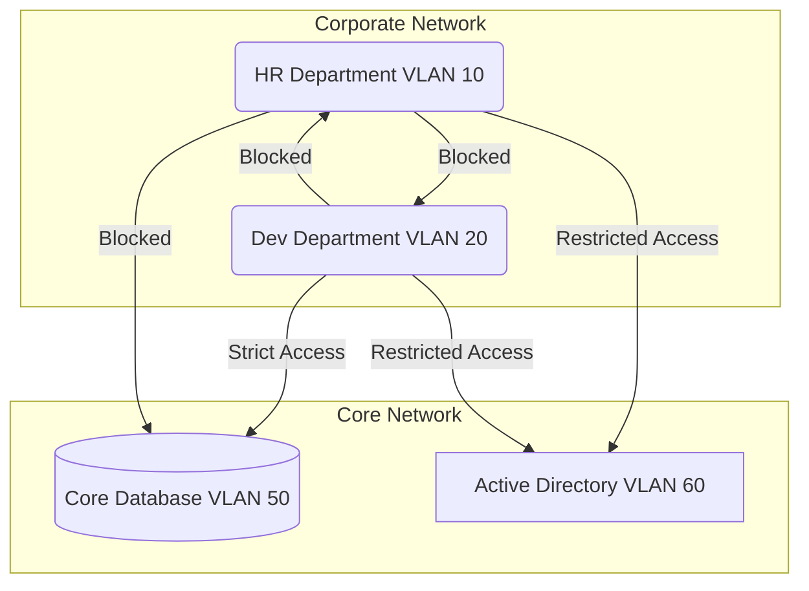

# 02. Internal Network Security & Segmentation

## 1. The Concept (ELI5)

Imagine a museum with extremely valuable artifacts. If the museum has a tough front door but inside there are no walls, guards, or locked glass cases, a thief who gets past the front door can easily steal everything. 

In enterprise networks, the "tough front door" is your external firewall. But if an attacker tricks an employee into clicking a phishing link, the attacker is now *inside*. If the network is flat (no walls), they can move freely from the receptionist's computer to the core database. **Network Segmentation and Zero Trust** are the interior walls, keycard scanners, and laser grids. They ensure that even if someone gets into one room, they can't easily walk into the vault. We enforce this through VLANs, micro-segmentation, and strict firewall rules between different business units.

## 2. The Visual



## 3. The Code

When building internal applications, developers often assume the internal network is "safe" and omit authentication or encrypting traffic in transit. This is a massive architectural flaw.

### Go (Internal Microservice)

❌ **Vulnerable Code: No TLS, No Auth for Internal API**
```go
package main

import (
	"encoding/json"
	"net/http"
)

func getUserData(w http.ResponseWriter, r *http.Request) {
    // Assuming internal network is safe, dumping raw data over HTTP
	data := map[string]string{"user": "admin", "ssn": "000-00-0000"}
	json.NewEncoder(w).Encode(data)
}

func main() {
	http.HandleFunc("/api/internal/users", getUserData)
	http.ListenAndServe(":8080", nil)
}
```

✅ **Production-Ready Secure Code: mTLS and Token Validation**
```go
package main

import (
	"crypto/tls"
	"crypto/x509"
	"encoding/json"
	"io/ioutil"
	"log"
	"net/http"
)

func getUserData(w http.ResponseWriter, r *http.Request) {
    // Require standard authentication even internally
    token := r.Header.Get("X-Internal-Token")
    if token != "expected-secure-token" {
        http.Error(w, "Unauthorized", http.StatusUnauthorized)
        return
    }

	data := map[string]string{"user": "admin", "id": "12345"}
	json.NewEncoder(w).Encode(data)
}

func main() {
    // Load CA cert for mTLS
    caCert, _ := ioutil.ReadFile("ca.crt")
    caCertPool := x509.NewCertPool()
    caCertPool.AppendCertsFromPEM(caCert)

    tlsConfig := &tls.Config{
        ClientCAs:  caCertPool,
        ClientAuth: tls.RequireAndVerifyClientCert,
    }

    server := &http.Server{
        Addr:      ":8443",
        TLSConfig: tlsConfig,
    }

    http.HandleFunc("/api/internal/users", getUserData)
    log.Fatal(server.ListenAndServeTLS("server.crt", "server.key"))
}
```

### Node.js (Internal DB Connection)

❌ **Vulnerable Code: Plaintext DB connection internally**
```javascript
const { Client } = require('pg');

// Connecting to DB without SSL because it's "in the same VPC"
const client = new Client({
  host: 'internal-db.local',
  user: 'dbadmin',
  password: 'supersecretpassword',
  port: 5432,
});
client.connect();
```

✅ **Production-Ready Secure Code: SSL Required**
```javascript
const { Client } = require('pg');
const fs = require('fs');

const client = new Client({
  host: 'internal-db.local',
  user: 'dbadmin',
  password: process.env.DB_PASSWORD,
  port: 5432,
  ssl: {
    rejectUnauthorized: true,
    ca: fs.readFileSync('/path/to/server-certificates/root.crt').toString(),
  },
});
client.connect();
```

## 4. The Guardrail

We use infrastructure as code to enforce network segmentation. 

### Terraform (Kubernetes Network Policies)
In a modern microservices environment, we use Network Policies to isolate namespaces.

```hcl
resource "kubernetes_network_policy" "deny_all" {
  metadata {
    name      = "default-deny-all"
    namespace = "production"
  }

  spec {
    pod_selector {}
    # Denies all ingress and egress by default
    policy_types = ["Ingress", "Egress"]
  }
}

resource "kubernetes_network_policy" "allow_frontend_to_backend" {
  metadata {
    name      = "allow-frontend-to-backend"
    namespace = "production"
  }

  spec {
    pod_selector {
      match_labels = {
        app = "backend"
      }
    }
    ingress {
      from {
        pod_selector {
          match_labels = {
            app = "frontend"
          }
        }
      }
      ports {
        port     = "8080"
        protocol = "TCP"
      }
    }
    policy_types = ["Ingress"]
  }
}
```

### Rego (OPA Policy for DB SSL)
```rego
package terraform.postgres_ssl

deny[msg] {
  db := input.resource.aws_db_instance[_]
  not db.require_secure_transport == true
  msg = sprintf("Database instance %v must enforce SSL/TLS for internal connections.", [db.name])
}
```
