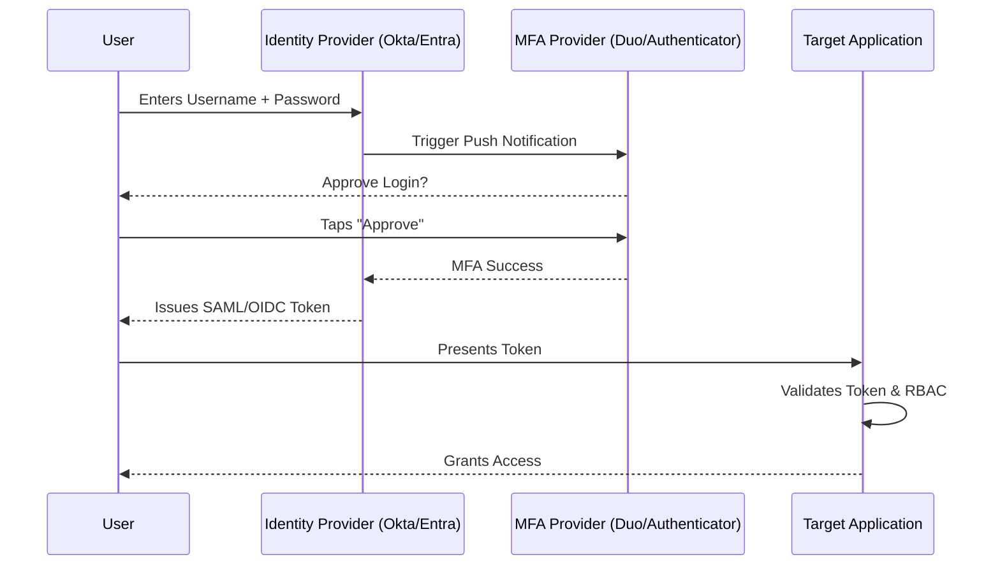

# 04. Identity & Access Management (IAM)

## 1. The Concept (ELI5)

Imagine you work in a highly secure government building. When you arrive on your first day, they don't just give you a master key that opens every door forever. They check your ID, take your fingerprint, and give you a badge. That badge only opens the front door and the door to your specific office. If you change jobs to a new department, your badge is updated to remove your old access and grant your new access. If you get fired, the badge is immediately deactivated. 

This is exactly what **Identity & Access Management (IAM)** does for a company's digital network. It ensures that the right people (Identity) get the right access (Authorization) to the right tools at the right time. A failure in IAM—like giving everyone a master key (over-privileged accounts) or forgetting to deactivate a fired employee's key (stale accounts)—is the number one way attackers breach companies.

## 2. The Visual



## 3. The Code

When implementing authentication in custom applications, developers often fail to correctly implement Role-Based Access Control (RBAC) or rely on insecure direct object references (IDOR) without checking the user's identity.

### Node.js (Express)

❌ **Vulnerable Code: Missing Authorization Check**
```javascript
const express = require('express');
const app = express();

// User is authenticated, but their role is never checked!
app.delete('/api/users/:id', authenticateToken, async (req, res) => {
    const userId = req.params.id;
    // Any authenticated user can delete ANY other user.
    await db.User.destroy({ where: { id: userId } });
    res.send("User deleted");
});
```

✅ **Production-Ready Secure Code: Role-Based Authorization**
```javascript
const express = require('express');
const app = express();

// Middleware to check if user has Admin role
function requireAdmin(req, res, next) {
    if (req.user.role !== 'ADMIN') {
        return res.status(403).json({ error: 'Forbidden: Admin access required' });
    }
    next();
}

// Both authentication AND authorization are enforced
app.delete('/api/users/:id', authenticateToken, requireAdmin, async (req, res) => {
    const userId = req.params.id;
    await db.User.destroy({ where: { id: userId } });
    res.send("User deleted successfully");
});
```

### Python (Django)

❌ **Vulnerable Code: Hardcoded / Bypassable Checks**
```python
from django.http import HttpResponse

def delete_financial_record(request, record_id):
    # Checking a parameter that the user can modify!
    if request.GET.get('is_admin') == 'true':
        Record.objects.get(id=record_id).delete()
        return HttpResponse("Deleted")
    return HttpResponse("Unauthorized", status=403)
```

✅ **Production-Ready Secure Code: Framework Built-in RBAC**
```python
from django.contrib.auth.decorators import permission_required
from django.http import HttpResponse
from django.shortcuts import get_object_or_404

# Enforces that the logged-in user MUST have this specific permission in the DB
@permission_required('finance.delete_record', raise_exception=True)
def delete_financial_record(request, record_id):
    record = get_object_or_404(Record, id=record_id)
    record.delete()
    return HttpResponse("Deleted")
```

## 4. The Guardrail

In cloud IAM, the Guardrail is ensuring that no user or role has `*` (wildcard) permissions. We use policies to enforce the Principle of Least Privilege.

### Terraform (AWS IAM Policy)

❌ **Vulnerable Terraform: AdministratorAccess via Wildcards**
```hcl
resource "aws_iam_policy" "bad_policy" {
  name = "dev_policy"
  policy = jsonencode({
    Version = "2012-10-17"
    Statement = [
      {
        Action   = "*"
        Effect   = "Allow"
        Resource = "*"
      }
    ]
  })
}
```

✅ **Secure Terraform: Scoped Least Privilege**
```hcl
resource "aws_iam_policy" "secure_policy" {
  name = "dev_s3_read_policy"
  policy = jsonencode({
    Version = "2012-10-17"
    Statement = [
      {
        Action   = [
            "s3:GetObject",
            "s3:ListBucket"
        ]
        Effect   = "Allow"
        Resource = [
            "arn:aws:s3:::company-dev-assets",
            "arn:aws:s3:::company-dev-assets/*"
        ]
      }
    ]
  })
}
```

### Rego (Enforce no IAM wildcards)
```rego
package terraform.iam_no_wildcards

deny[msg] {
  policy := input.resource.aws_iam_policy[_]
  statement := json.unmarshal(policy.policy).Statement[_]
  statement.Effect == "Allow"
  statement.Action == "*"
  msg = sprintf("IAM Policy %v contains dangerous wildcard actions.", [policy.name])
}
```
