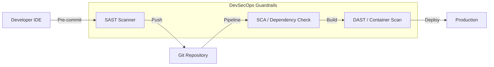

# 05. Application Security Architecture

## 1. The Concept (ELI5)

Imagine you are running a restaurant. **Application Security Architecture** is like the health inspector's rulebook combined with the kitchen's layout. 

If the raw chicken (untrusted user input) is kept right next to the fresh salad (database execution), people will get sick (SQL Injection). If the recipes (source code) contain the safe combination to the vault (hardcoded secrets), an employee might steal the money. 

Assessing AppSec architecture means looking at how the software is built, how it handles data, and ensuring that security checks (like washing hands and cooking meat to temp) are baked into the assembly line (the CI/CD pipeline). This is called DevSecOps.

## 2. The Visual

A secure software development lifecycle (SDLC) incorporates automated checks at every stage.



## 3. The Code

A core architectural flaw is failing to parameterize database queries, leading to SQL Injection.

### Go

❌ **Vulnerable Code: String Concatenation**
```go
import "database/sql"

func getUser(db *sql.DB, username string) {
    // DO NOT DO THIS. Raw input is concatenated into the query.
    query := "SELECT * FROM users WHERE username = '" + username + "'"
    rows, _ := db.Query(query)
    // process rows...
}
```

✅ **Production-Ready Secure Code: Parameterized Queries**
```go
import "database/sql"

func getUser(db *sql.DB, username string) {
    // The database driver safely handles the substitution, preventing injection
    query := "SELECT * FROM users WHERE username = $1"
    rows, err := db.Query(query, username)
    if err != nil {
        // handle error
    }
    // process rows...
}
```

### Python (SQLAlchemy)

❌ **Vulnerable Code: Raw Execution**
```python
from sqlalchemy import text

def get_user(db_session, username):
    # Executing raw SQL with user input
    query = text(f"SELECT * FROM users WHERE username = '{username}'")
    result = db_session.execute(query)
    return result.fetchall()
```

✅ **Production-Ready Secure Code: ORM Abstraction**
```python
from models import User

def get_user(db_session, username):
    # Utilizing the ORM safely parameterizes the query in the background
    user = db_session.query(User).filter(User.username == username).first()
    return user
```

### TypeScript (Prisma)

❌ **Vulnerable Code: Raw Query Injection**
```typescript
import { PrismaClient } from '@prisma/client'
const prisma = new PrismaClient()

async function getUser(username: string) {
  // Prisma allows raw queries, which can be vulnerable if abused
  const users = await prisma.$queryRawUnsafe(`SELECT * FROM User WHERE name = '${username}'`)
  return users
}
```

✅ **Production-Ready Secure Code: Type-Safe ORM**
```typescript
import { PrismaClient } from '@prisma/client'
const prisma = new PrismaClient()

async function getUser(username: string) {
  // Secure by design, Prisma handles the parameterization
  const user = await prisma.user.findUnique({
    where: {
      name: username,
    },
  })
  return user
}
```

## 4. The Guardrail

To enforce Application Security Architecture, we implement CI/CD rules that break the build if a vulnerability is detected.

### Semgrep Rule (Detect SQL Injection in Node.js)
```yaml
rules:
  - id: node-sql-injection
    patterns:
      - pattern: |
          $DB.query(..., <... $REQ.$QUERY ...>, ...)
      - pattern-not: |
          $DB.query("...", [$REQ.$QUERY], ...)
    message: "Potential SQL Injection detected. Use parameterized queries."
    languages:
      - javascript
      - typescript
    severity: ERROR
```

### GitHub Actions (Enforce SAST)
```yaml
name: DevSecOps Pipeline
on: [push, pull_request]

jobs:
  security-scan:
    runs-on: ubuntu-latest
    steps:
      - uses: actions/checkout@v3
      - name: Run Semgrep
        uses: returntocorp/semgrep-action@v1
        with:
          config: "p/default"
      - name: Run Dependency Check (SCA)
        uses: snyk/actions/node@master
        env:
          SNYK_TOKEN: ${{ secrets.SNYK_TOKEN }}
```
