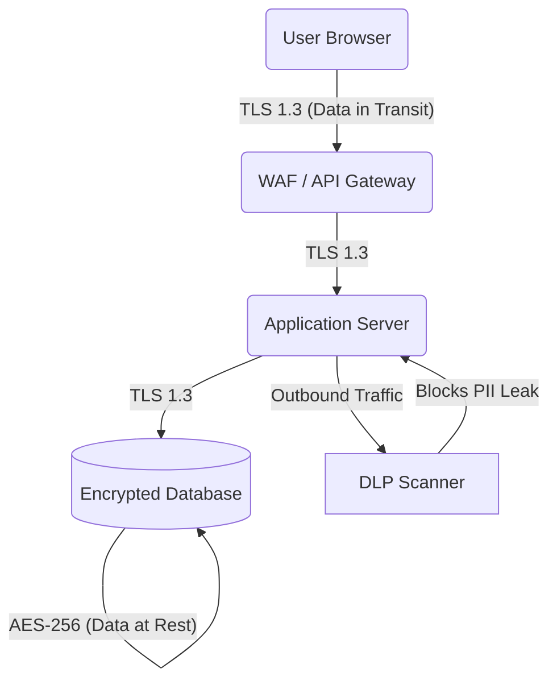

# 06. Data Security & Loss Prevention

## 1. The Concept (ELI5)

Imagine you own a bank. You have massive piles of cash (Data). 
- **Data at Rest**: The cash sitting inside the vault. You need thick steel walls and locks (Encryption at Rest) to protect it.
- **Data in Transit**: The armored trucks moving cash between branches. You need armed guards and secure vehicles (TLS/SSL Encryption) to protect it while it's moving.
- **Data Loss Prevention (DLP)**: The security guard at the exit checking employees' bags to make sure they aren't walking out with stacks of cash hidden in their coats. 

An enterprise must classify its data (Public, Internal, Confidential, Restricted) and apply technical controls to ensure sensitive data cannot be easily stolen, leaked, or ransomed.

## 2. The Visual



## 3. The Code

A frequent issue in data security is logging sensitive information. Developers accidentally write passwords, API keys, or PII (Personally Identifiable Information) to application logs, which are then synced to central logging systems (like Splunk or Datadog) where everyone can read them.

### Python (Logging)

❌ **Vulnerable Code: Logging PII**
```python
import logging

def process_payment(user_id, credit_card):
    # FATAL ERROR: Logging raw credit card numbers
    logging.info(f"Processing payment for user {user_id} with card {credit_card}")
    # charge card...
```

✅ **Production-Ready Secure Code: Data Masking**
```python
import logging

def mask_cc(card_number):
    if len(card_number) >= 4:
        return f"****-****-****-{card_number[-4:]}"
    return "****"

def process_payment(user_id, credit_card):
    # Only log the masked representation
    logging.info(f"Processing payment for user {user_id} with card {mask_cc(credit_card)}")
    # charge card...
```

### TypeScript (Node.js Logging)

❌ **Vulnerable Code: Dumping entire Request Object**
```typescript
import * as express from 'express';
const app = express();

app.post('/login', (req, res) => {
    // Logs the entire request body, which includes plaintext passwords!
    console.log("Incoming login request payload:", req.body);
    res.send("Logged in");
});
```

✅ **Production-Ready Secure Code: Allowlisting log fields**
```typescript
import * as express from 'express';
const app = express();

app.post('/login', (req, res) => {
    // Explicitly select safe fields to log
    console.log("Incoming login attempt for username:", req.body.username);
    // process login...
    res.send("Logged in");
});
```

## 4. The Guardrail

We use automated scanners to catch secrets and PII before they are committed to source control or logged.

### Semgrep Rule (Prevent Logging PII)
```yaml
rules:
  - id: prevent-logging-pii
    patterns:
      - pattern-either:
          - pattern: logging.info(..., <... password ...>, ...)
          - pattern: logging.info(..., <... credit_card ...>, ...)
          - pattern: console.log(..., req.body, ...)
    message: "Do not log sensitive variables like passwords, tokens, or raw request bodies."
    languages:
      - python
      - javascript
      - typescript
    severity: ERROR
```

### Pre-commit Hook (TruffleHog / GitLeaks)
To prevent developers from pushing hardcoded secrets (Data Loss Prevention in code), enforce a pre-commit hook:

```yaml
repos:
  - repo: https://github.com/zricethezav/gitleaks
    rev: v8.16.1
    hooks:
      - id: gitleaks
```
