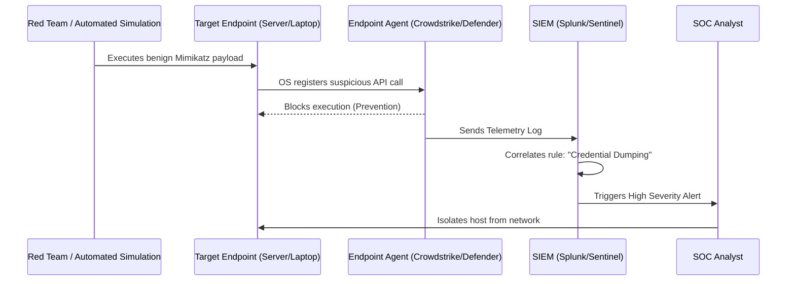

# 07. Defensive Controls Validation

## 1. The Concept (ELI5)

Imagine you spend a million dollars installing the most advanced burglar alarm system in the world. You put sensors on every window, lasers in the hallway, and cameras in every corner. But what if you never actually test it? What if a mouse chewed through the wire of the window sensor? What if the camera is pointing at the ceiling?

**Defensive Controls Validation** (often called Purple Teaming or Breach & Attack Simulation) is the act of hiring a fake burglar to gently bump against the windows and walk past the cameras to make sure the alarms actually go off, and that the police (the Security Operations Center, or SOC) actually show up. It verifies that your SIEM (Security Information and Event Management) and EDR (Endpoint Detection and Response) are functioning correctly.

## 2. The Visual



## 3. The Code

You cannot code "Defensive Controls" directly in an application, but you can code the telemetry (logs) that the SOC relies on, and you can script the validations.

### Python (Generating Validatable Audit Logs)

❌ **Vulnerable Code: Insufficient Audit Logging**
```python
def change_user_role(admin_user, target_user, new_role):
    # Updating the DB but leaving no trace for the SOC
    db.execute("UPDATE users SET role=? WHERE id=?", (new_role, target_user.id))
    return True
```

✅ **Production-Ready Secure Code: Security Audit Trails**
```python
import json
import logging

# Ensure audit logs are written in a structured JSON format 
# that the SIEM can easily parse and alert on.
audit_logger = logging.getLogger("security_audit")

def change_user_role(admin_user, target_user, new_role):
    db.execute("UPDATE users SET role=? WHERE id=?", (new_role, target_user.id))
    
    audit_event = {
        "event_type": "IAM_ROLE_CHANGE",
        "actor_id": admin_user.id,
        "actor_ip": admin_user.ip_address,
        "target_id": target_user.id,
        "new_role": new_role,
        "status": "SUCCESS"
    }
    audit_logger.info(json.dumps(audit_event))
    return True
```

### PowerShell (Red Team Validation Script)

A simple script to test if your EDR detects classic enumeration commands.

```powershell
# simulate_recon.ps1
# This should trigger a "Suspicious Discovery Commands" alert in your SIEM.
Write-Host "Simulating Threat Actor Reconnaissance..."

# Whoami /all
whoami /all

# Network enumeration
arp -a
ipconfig /all

# Active Directory enumeration
net user /domain
net group "Domain Admins" /domain

Write-Host "Recon simulation complete. Check your SIEM for alerts!"
```

## 4. The Guardrail

Defensive validation requires defining Detection as Code (DaC). We use Sigma rules to define what our SIEM should alert on, completely agnostic of the vendor.

### Sigma Rule (Detecting the Recon Script)
```yaml
title: Suspicious Network and Domain Reconnaissance
id: 12345678-1234-1234-1234-123456789012
status: test
description: Detects rapid execution of enumeration commands typically used by attackers.
logsource:
    category: process_creation
    product: windows
detection:
    selection:
        Image|endswith:
            - '\whoami.exe'
            - '\arp.exe'
            - '\ipconfig.exe'
            - '\net.exe'
    condition: selection
    timeframe: 1m
    condition_threshold: 3 # Triggers if 3 of these run within 1 minute
falsepositives:
    - IT Administrators troubleshooting networks
level: medium
```
