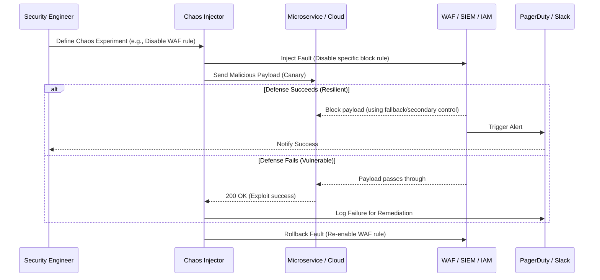

# Introduction to Security Chaos Engineering

## 1. The Concept (ELI5)

Imagine you own a highly secure bank. You have vault doors, motion sensors, laser tripwires, and armed guards. How do you know all of this actually works when a robbery happens? You could wait for a real bank robber to find out, or you could hire a "red team" to try and rob it. But Security Chaos Engineering (SCE) goes one step further. 

Instead of just trying to break in, SCE asks: "What happens if the power to the laser tripwires randomly fails? Does the backup generator kick in fast enough? Do the guards get alerted?" 

In software, SCE is like running relentless, automated fire drills. It is the practice of **intentionally injecting security failures and faults** into your systems to see how your defenses react. It helps you discover gaps between what you *think* your security posture is and what it *actually* is in production. 

### Why not just rely on Red Teaming?
Red teaming is fantastic, but it is often point-in-time, manual, and relies on human creativity to bypass defenses. SCE is systematic, automated, continuous, and focuses on the resilience of the system when known security controls fail or degrade.

## 2. The Visual

Here is the architectural blueprint of how Security Chaos Engineering fits into a modern cloud-native environment:



## 3. The Code

Let's look at a basic example of how an application might handle unexpected security context failures, such as an identity provider (IdP) suddenly becoming unreachable.

### ❌ Vulnerable Code (Fails Open or Crashes)

If the authentication service fails, this code crashes or defaults to an insecure state.

**Go:**
```go
func AuthenticateUser(token string) bool {
    // Fails completely if the auth server is unreachable
    resp, err := http.Get("https://auth.internal/verify?token=" + token)
    if err != nil {
        // Danger: Returning true to "prevent downtime" (Fail Open)
        // OR crashing the service completely
        return true 
    }
    return resp.StatusCode == 200
}
```

**Python:**
```python
def check_permissions(user_id):
    try:
        response = requests.get(f"http://iam-service/users/{user_id}/roles")
        return "admin" in response.json().get("roles", [])
    except Exception as e:
        # Fails open on timeout!
        return True
```

**TypeScript/Node.js:**
```typescript
async function verifyToken(token: string) {
    try {
        const result = await authService.verify(token);
        return result.isValid;
    } catch (error) {
        // Ignores the error and grants access
        console.error("Auth service down");
        return true;
    }
}
```

### ✅ Production-Ready Secure Code (Resilient / Fails Closed)

When chaos is injected (e.g., blocking network access to the IAM service), the system gracefully fails closed, denying access rather than allowing unauthorized access or crashing.

**Go:**
```go
func AuthenticateUser(ctx context.Context, token string) (bool, error) {
    req, err := http.NewRequestWithContext(ctx, "GET", "https://auth.internal/verify?token="+token, nil)
    if err != nil {
        return false, fmt.Errorf("failed to create request: %w", err)
    }

    client := &http.Client{Timeout: 2 * time.Second}
    resp, err := client.Do(req)
    if err != nil {
        // Fail Closed: If we can't verify, deny access.
        log.Printf("Auth service unavailable: %v. Denying access.", err)
        return false, errors.New("authentication service unavailable")
    }
    defer resp.Body.Close()

    return resp.StatusCode == 200, nil
}
```

**Python:**
```python
import requests
import logging

def check_permissions(user_id: str) -> bool:
    try:
        response = requests.get(
            f"http://iam-service/users/{user_id}/roles",
            timeout=2.0
        )
        response.raise_for_status()
        return "admin" in response.json().get("roles", [])
    except requests.exceptions.RequestException as e:
        # Fail Closed: Log the failure and deny access
        logging.error(f"IAM Service unreachable: {e}. Defaulting to least privilege.")
        return False
```

**TypeScript/Node.js:**
```typescript
import axios from 'axios';
import logger from './logger';

async function verifyToken(token: string): Promise<boolean> {
    try {
        const response = await axios.get('http://auth-service/verify', {
            headers: { Authorization: `Bearer ${token}` },
            timeout: 2000
        });
        return response.status === 200;
    } catch (error) {
        // Fail Closed: Always deny access if verification fails
        logger.error(`Auth service unavailable or token invalid: ${error.message}`);
        return false;
    }
}
```

## 4. The Guardrail

To ensure services are designed with resilience in mind, we can use Semgrep to detect "fail open" patterns where exceptions in security checks return `true` or grant access.

**Semgrep Rule (`fail-closed-check.yaml`):**
```yaml
rules:
  - id: python-fail-open-auth
    patterns:
      - pattern: |
          try:
            ...
            $REQ
            ...
          except $EX:
            ...
            return True
    message: "Security Control Failure: Exception block returns True. Security checks must fail closed (return False) when external services are unavailable."
    languages: [python]
    severity: ERROR
```
