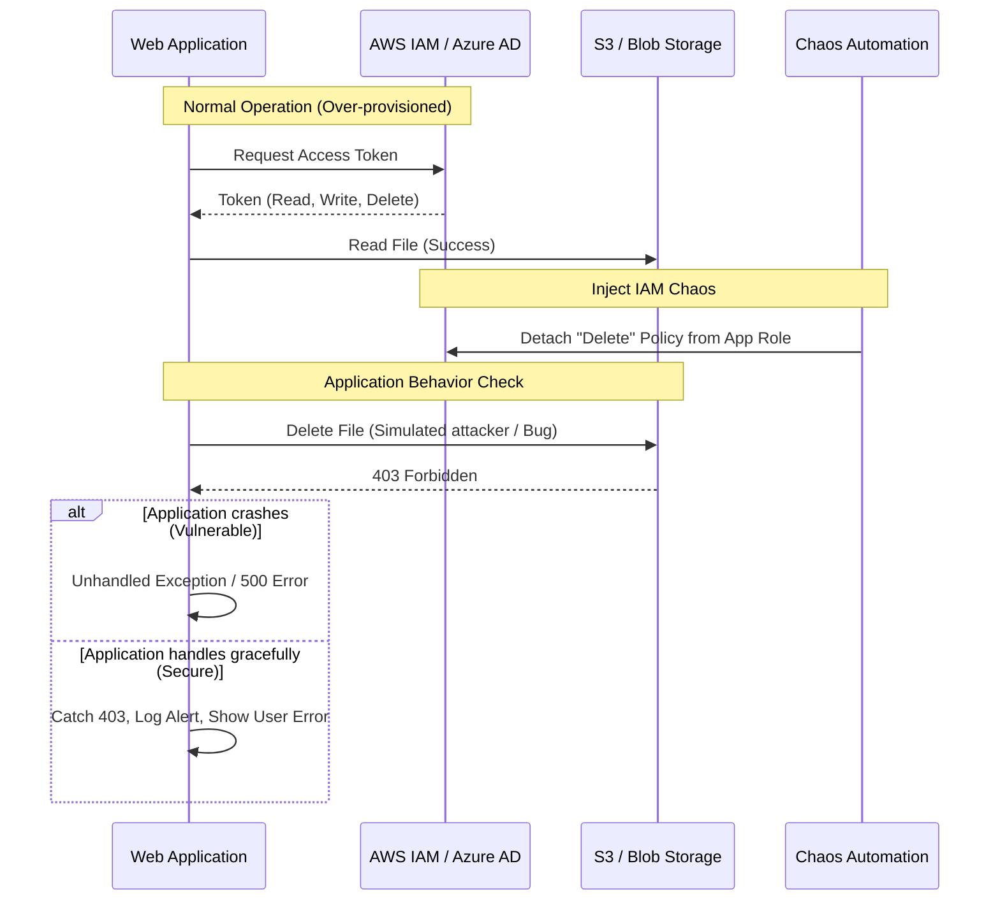

# IAM Permission Chaos

## 1. The Concept (ELI5)

Imagine you give your house sitter a key that opens the front door, the garage, and your personal safe. If they only need to water the plants, why do they have the key to the safe? 

Identity and Access Management (IAM) is about ensuring entities (users or services) have *only* the keys they need (Least Privilege). **IAM Permission Chaos** involves systematically and temporarily revoking certain permissions from a service in production to see what breaks. 

If you remove the `s3:DeleteObject` permission from your web server and *nothing breaks*, it means the web server never needed that permission in the first place. If you remove `s3:GetObject` and the application crashes instead of displaying a graceful error, your error handling is inadequate. IAM Chaos tests both your least-privilege boundaries and your application's graceful degradation.

## 2. The Visual



## 3. The Code

When IAM permissions are revoked (chaos injection), how does the application code handle the sudden loss of access? 

### ❌ Vulnerable Code (Assuming Permissions Exist)

This code assumes the IAM role attached to the compute instance has permanent, unchanging access. If a permission is revoked, the application throws an unhandled exception or enters a bad state.

**Go:**
```go
func UploadAvatar(sess *session.Session, bucket string, filename string, data io.Reader) error {
    svc := s3.New(sess)
    
    // VULNERABLE: Assumes the IAM role has PutObject. 
    // If permission is revoked, it returns a raw AWS error to the caller,
    // potentially leaking infrastructure details.
    _, err := svc.PutObject(&s3.PutObjectInput{
        Bucket: aws.String(bucket),
        Key:    aws.String(filename),
        Body:   aws.ReadSeekCloser(data),
    })
    
    return err 
}
```

**Python:**
```python
import boto3

def read_config_file():
    s3 = boto3.client('s3')
    # VULNERABLE: No error handling for AccessDenied.
    # Application crashes entirely if IAM chaos removes s3:GetObject.
    response = s3.get_object(Bucket='my-config-bucket', Key='app-config.json')
    return response['Body'].read()
```

**TypeScript/Node.js:**
```typescript
import { S3Client, GetObjectCommand } from "@aws-sdk/client-s3";

const client = new S3Client({});

async function getSecretData() {
    const command = new GetObjectCommand({ Bucket: "secrets", Key: "data.txt" });
    // VULNERABLE: Unhandled promise rejection if IAM permission is missing
    const response = await client.send(command);
    return response.Body;
}
```

### ✅ Production-Ready Secure Code (Graceful Degradation)

Secure code handles `AccessDenied` errors explicitly. It logs the security event and returns a safe, generic error to the user, allowing the rest of the application to continue functioning (graceful degradation).

**Go:**
```go
func UploadAvatar(sess *session.Session, bucket string, filename string, data io.Reader) error {
    svc := s3.New(sess)
    
    _, err := svc.PutObject(&s3.PutObjectInput{
        Bucket: aws.String(bucket),
        Key:    aws.String(filename),
        Body:   aws.ReadSeekCloser(data),
    })
    
    if err != nil {
        // Secure: Inspect the error type
        if aerr, ok := err.(awserr.Error); ok {
            if aerr.Code() == "AccessDenied" {
                log.Printf("SECURITY ALERT: IAM Access Denied writing to %s", bucket)
                // Return generic error to user
                return errors.New("unable to upload avatar at this time")
            }
        }
        log.Printf("S3 Upload error: %v", err)
        return errors.New("internal system error")
    }
    
    return nil
}
```

**Python:**
```python
import boto3
from botocore.exceptions import ClientError
import logging

def read_config_file():
    s3 = boto3.client('s3')
    try:
        response = s3.get_object(Bucket='my-config-bucket', Key='app-config.json')
        return response['Body'].read()
    except ClientError as e:
        error_code = e.response['Error']['Code']
        if error_code == 'AccessDenied':
            logging.error("SECURITY ALERT: IAM permissions revoked for config bucket.")
            # Fallback to local default config to prevent total crash
            return load_local_default_config()
        else:
            logging.error(f"S3 Error: {e}")
            raise
```

**TypeScript/Node.js:**
```typescript
import { S3Client, GetObjectCommand } from "@aws-sdk/client-s3";
import logger from './logger';

const client = new S3Client({});

async function getSecretData() {
    const command = new GetObjectCommand({ Bucket: "secrets", Key: "data.txt" });
    try {
        const response = await client.send(command);
        return response.Body;
    } catch (error: any) {
        if (error.name === 'AccessDenied' || error.$metadata?.httpStatusCode === 403) {
            logger.error("SECURITY ALERT: Missing IAM permissions for S3 bucket");
            throw new Error("Service temporarily degraded"); // Generic message
        }
        logger.error(`S3 operation failed: ${error.message}`);
        throw new Error("Internal Service Error");
    }
}
```

## 4. The Guardrail

To enforce least privilege proactively so that IAM Chaos experiments pass, we use Terraform and static analysis tools like `tfsec` or `checkov` to prevent wildcards (`*`) in IAM policies.

**Terraform (AWS IAM Policy Check):**

```hcl
# ❌ VULNERABLE: Uses wildcards for actions and resources
resource "aws_iam_policy" "vulnerable_policy" {
  name = "vulnerable_policy"
  policy = jsonencode({
    Version = "2012-10-17"
    Statement = [{
      Action   = "s3:*"
      Effect   = "Allow"
      Resource = "*"
    }]
  })
}

# ✅ SECURE: Strictly scopes actions and resources
resource "aws_iam_policy" "secure_policy" {
  name = "secure_policy"
  policy = jsonencode({
    Version = "2012-10-17"
    Statement = [{
      Action   = ["s3:GetObject", "s3:PutObject"]
      Effect   = "Allow"
      Resource = "arn:aws:s3:::my-app-bucket/*"
    }]
  })
}
```

**Checkov/Rego Guardrail:**
Checkov natively blocks `*` in IAM policies. To enforce this, run:
`checkov -d . --check CKV_AWS_1` (Ensure IAM policies that allow full "*-*" administrative privileges are not created).
