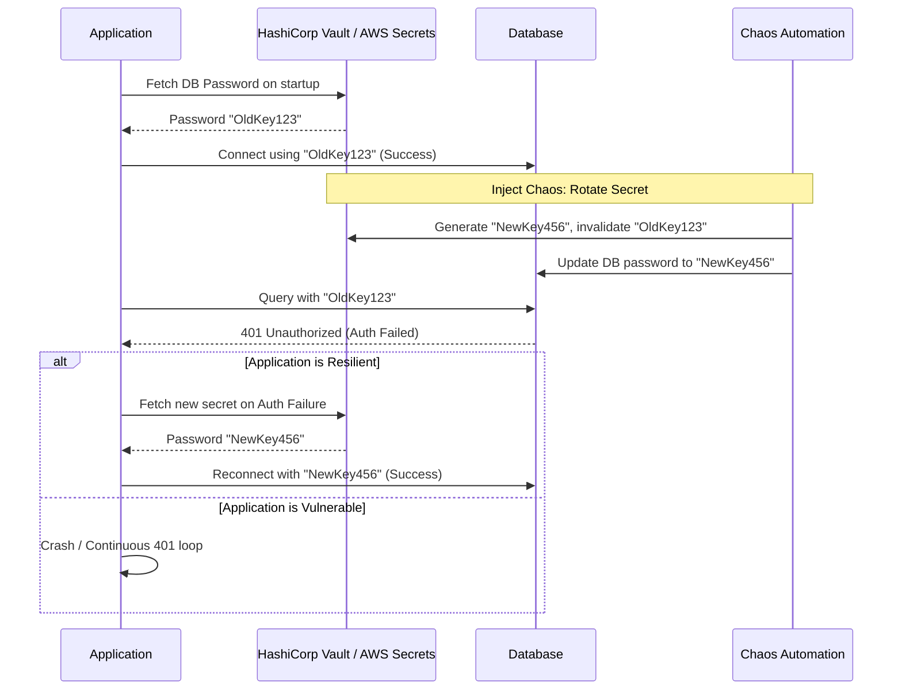

# Secret Rotation Verification

## 1. The Concept (ELI5)

Imagine you change the locks on your front door because you lost a key. That's a great security measure. But what if you forget to give the new key to your spouse, and they are locked out? 

In software, rotating secrets (like database passwords, API keys, or JWT signing keys) is a critical security practice. However, many systems break when a secret is rotated because the application only reads the secret once when it starts up, and caches it forever. 

**Secret Rotation Chaos** involves intentionally invalidating or rotating a secret in the middle of the day to see if your application automatically fetches the new secret without requiring a manual reboot. If a real attacker compromises a key, you need to be able to revoke it instantly without taking down your production environment.

## 2. The Visual



## 3. The Code

Applications must be designed to handle `Unauthorized` or `Authentication Failed` errors gracefully by triggering a re-fetch of credentials and a connection retry.

### ❌ Vulnerable Code (Static Secret Caching)

This code reads the secret from environment variables or a vault *only once* at startup. If the secret rotates, the app will fail continuously until it is manually restarted.

**Go:**
```go
var dbPassword string

func init() {
    // VULNERABLE: Secret is read once at startup. 
    // If rotated, this application must be restarted to get the new secret.
    dbPassword = os.Getenv("DB_PASSWORD") 
}

func GetDBConnection() *sql.DB {
    connStr := fmt.Sprintf("user=admin password=%s dbname=app", dbPassword)
    db, _ := sql.Open("postgres", connStr)
    return db
}
```

**Python:**
```python
import os
import psycopg2

# VULNERABLE: Global variable assigned at startup
DB_PASS = os.getenv("DB_PASSWORD")

def query_db():
    try:
        conn = psycopg2.connect(user="admin", password=DB_PASS, host="db")
        # execute query...
    except psycopg2.OperationalError:
        # Fails permanently if DB_PASS is no longer valid
        raise
```

### ✅ Production-Ready Secure Code (Dynamic Secret Fetching on Failure)

Secure code catches authentication errors and attempts to fetch a fresh secret from the Secret Manager, enabling zero-downtime rotations.

**Go:**
```go
type DBConnector struct {
    secretManager *secrets.Client
    currentPass   string
}

func (c *DBConnector) Query(query string) error {
    db, err := sql.Open("postgres", fmt.Sprintf("user=admin password=%s", c.currentPass))
    if err != nil {
        return err
    }
    
    _, err = db.Exec(query)
    if err != nil {
        // SECURE: Detect authentication failure (e.g., PostgreSQL code 28P01)
        if strings.Contains(err.Error(), "password authentication failed") {
            log.Println("Auth failed, attempting secret rotation recovery...")
            newPass, fetchErr := c.secretManager.GetSecret("db_password")
            if fetchErr == nil {
                c.currentPass = newPass
                // Retry logic here...
                return c.retryQuery(query)
            }
        }
    }
    return err
}
```

**Python:**
```python
import psycopg2
import logging
from my_vault import fetch_secret

class DatabaseClient:
    def __init__(self):
        self.password = fetch_secret("db_password")

    def query(self, sql):
        try:
            conn = psycopg2.connect(user="admin", password=self.password, host="db")
            # execute...
        except psycopg2.OperationalError as e:
            if "password authentication failed" in str(e):
                logging.warning("Auth failed. Secret may have rotated. Refetching...")
                self.password = fetch_secret("db_password")
                # Retry logic
                return self._retry_query(sql)
            raise
```

**TypeScript/Node.js:**
```typescript
import { Client } from 'pg';
import { getSecret } from './secretManager';

let dbPassword = await getSecret('db_password');

async function executeQuery(query: string) {
    let client = new Client({ user: 'admin', password: dbPassword });
    
    try {
        await client.connect();
        return await client.query(query);
    } catch (error: any) {
        if (error.code === '28P01') { // PostgreSQL invalid_password
            console.warn("Invalid password detected, fetching fresh secret...");
            dbPassword = await getSecret('db_password');
            
            // Re-instantiate client with new password and retry
            client = new Client({ user: 'admin', password: dbPassword });
            await client.connect();
            return await client.query(query);
        }
        throw error;
    } finally {
        await client.end();
    }
}
```

## 4. The Guardrail

To ensure applications don't rely on static, long-lived environment variables for sensitive data, we can use Semgrep to flag direct usage of `os.environ` or `os.getenv` for passwords.

**Semgrep Rule (`no-env-passwords.yaml`):**
```yaml
rules:
  - id: python-no-static-env-passwords
    patterns:
      - pattern: os.environ.get($KEY)
      - metavariable-regex:
          metavariable: $KEY
          regex: (?i).*(password|secret|token|key).*
    message: "Secrets should not be loaded from static environment variables. Use a dynamic Secret Manager SDK (e.g., AWS Secrets Manager, Vault) to support secret rotation."
    languages: [python]
    severity: WARNING
```
