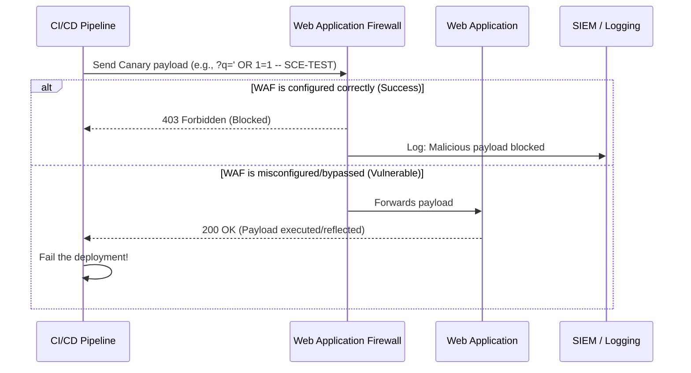

# Canary Payloads

## 1. The Concept (ELI5)

Imagine you install a brand-new metal detector at the entrance of a building. How do you know it actually works? You don't wait for a real weapon to be brought in; instead, you walk through with a safe, standardized piece of metal (like a heavy belt buckle) to ensure the alarm sounds. 

In cybersecurity, **Canary Payloads** are exactly that. They are safe, benign, but highly recognizable strings of data injected into your system's traffic to test if your Web Application Firewall (WAF), Runtime Application Self-Protection (RASP), or Intrusion Detection System (IDS) is actually watching. 

If you send the string `<script>alert('SCE-CANARY-X9F2')</script>` to your application and the WAF doesn't block it, you know your WAF is misconfigured or in "learning mode"—without having to wait for a real XSS attack to compromise your users.

## 2. The Visual



## 3. The Code

When writing chaos tests for Canary Payloads, you are usually writing the *injector* code that runs from your CI/CD pipeline against your staging or production environment.

### ❌ Vulnerable Approach (No Verification)

Many organizations deploy a WAF via Terraform, assume it works, and never actively test it with payloads.

**Deployment Script (Python):**
```python
def deploy_app():
    # Deploys the infrastructure and WAF
    deploy_terraform()
    
    # Verifies the app is UP, but DOES NOT verify security controls
    response = requests.get("https://production.example.com/health")
    if response.status_code == 200:
        print("Deployment successful!")
    else:
        raise Exception("App is down")
```

### ✅ Production-Ready Secure Code (Canary Injection)

This script acts as the Chaos Agent. It intentionally sends SQL Injection (SQLi) and Cross-Site Scripting (XSS) canaries to verify that the edge defenses are actively blocking malicious traffic.

**Python (Chaos Injector in CI/CD):**
```python
import requests
import sys

TARGET_URL = "https://production.example.com/search"

# Safe, uniquely identifiable payloads that should trigger WAF rules
CANARY_PAYLOADS = [
    "?q=<script>alert('SCE-XSS-CANARY')</script>",
    "?q=admin' OR 1=1 -- SCE-SQLI-CANARY",
    "?q=../../../etc/passwd # SCE-LFI-CANARY"
]

def run_canary_test():
    print(f"Injecting Canary Payloads against {TARGET_URL}...")
    
    for payload in CANARY_PAYLOADS:
        url = f"{TARGET_URL}{payload}"
        headers = {"User-Agent": "Security-Chaos-Engineering-Bot"}
        
        response = requests.get(url, headers=headers)
        
        # SECURE: We EXPECT the WAF to block this (403, 406, or 429)
        if response.status_code == 200:
            print(f"[FAILED] WAF bypassed! Payload executed: {payload}")
            sys.exit(1) # Fail the CI/CD pipeline
        else:
            print(f"[SUCCESS] Canary blocked with status {response.status_code}: {payload}")

if __name__ == "__main__":
    run_canary_test()
```

**Go (Chaos Injector):**
```go
package main

import (
    "fmt"
    "net/http"
    "os"
)

func main() {
    targetURL := "https://production.example.com/search"
    payloads := []string{
        "?q=<script>alert('SCE-XSS-CANARY')</script>",
        "?q=admin'+OR+1=1+--+SCE-SQLI",
    }

    client := &http.Client{}

    for _, payload := range payloads {
        req, _ := http.NewRequest("GET", targetURL+payload, nil)
        req.Header.Set("User-Agent", "Chaos-Canary")

        resp, err := client.Do(req)
        if err != nil {
            fmt.Printf("Request error: %v\n", err)
            continue
        }

        // We want a 403 Forbidden. A 200 OK means the WAF failed.
        if resp.StatusCode == http.StatusOK {
            fmt.Printf("CRITICAL: Canary slipped through WAF! %s\n", payload)
            os.Exit(1)
        }
        fmt.Printf("Verified Blocked: %s (Status: %d)\n", payload, resp.StatusCode)
    }
}
```

## 4. The Guardrail

To ensure that developers don't inadvertently disable WAF rules in infrastructure as code, we can use Rego (OPA) or Checkov to enforce that WAF ACLs are attached to Application Load Balancers.

**Terraform Guardrail (Rego / OPA):**
```rego
package terraform.aws.waf

deny[msg] {
    # Check for Application Load Balancers
    resource := input.resource.aws_lb[name]
    resource.load_balancer_type == "application"
    
    # Ensure there is a corresponding WAF association
    not waf_associated(name)
    
    msg := sprintf("Application Load Balancer '%v' is not associated with a WAF Web ACL.", [name])
}

waf_associated(lb_name) {
    association := input.resource.aws_wafv2_web_acl_association[_]
    # Check if the association points to the ALB
    contains(association.resource_arn, lb_name)
}
```
