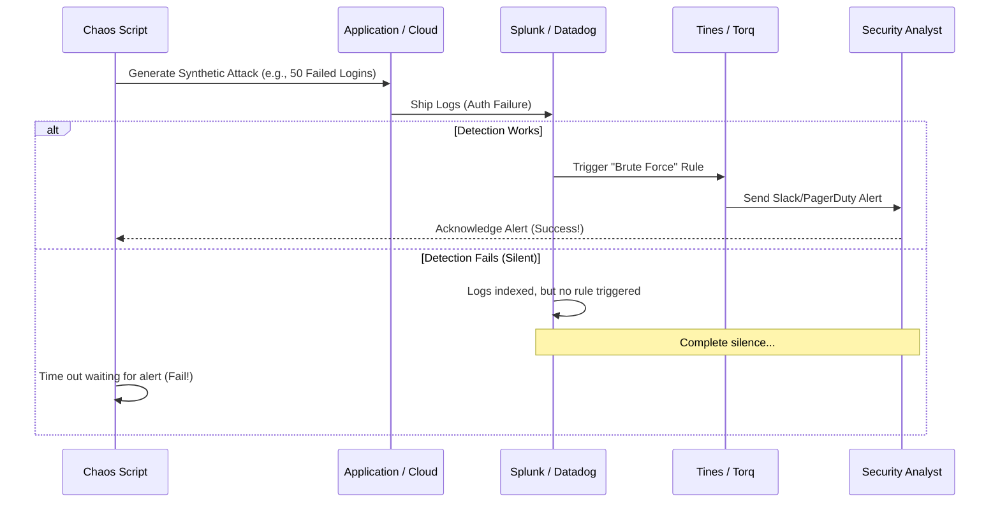

# Incident Response Chaos (SIEM Validation)

## 1. The Concept (ELI5)

Imagine you install a smoke detector in your house. You test the button, and it beeps. Great! But what if the battery dies a month later, or the speaker breaks? The only way to truly know it works is to occasionally light a match under it.

In Security Operations, your SIEM (Security Information and Event Management) system and your SOC (Security Operations Center) are your smoke detectors and firefighters. **Incident Response Chaos** involves intentionally generating synthetic malicious activity—like a fake brute-force login attack or a simulated AWS CloudTrail disruption—to see if:
1. The logs actually make it to the SIEM.
2. The SIEM rules trigger an alert.
3. The alert actually pages the security team (PagerDuty/Slack).

If you inject chaos and the SOC stays quiet, your detection engineering has failed.

## 2. The Visual



## 3. The Code

This is an example of a chaos experiment that generates fake telemetry to validate a SIEM rule for "Excessive Failed Logins".

### ❌ Vulnerable (Assuming Logs = Alerts)

Many teams just assume that because an application writes a log `logger.error("Login failed")`, the security team will see it. This is a false sense of security.

### ✅ Production-Ready Secure Code (Chaos Injector for SIEM)

This script automates the generation of the attack and then (if you have API access to your alerting system) checks to ensure the alert was actually created.

**Python (SIEM Chaos Injector):**
```python
import requests
import time
import sys

APP_LOGIN_URL = "https://app.example.com/api/login"
PD_API_KEY = "your-pagerduty-api-key"
EXPECTED_ALERT_NAME = "Excessive Failed Logins Detected"

def inject_brute_force_chaos():
    print("Injecting Brute Force Chaos...")
    
    # 1. Generate 50 failed logins in 5 seconds to trigger the SIEM threshold
    for i in range(50):
        requests.post(APP_LOGIN_URL, json={
            "username": "admin",
            "password": f"wrongpass_{i}",
            "chaos_tag": "sce-experiment-001" # Easily filterable by SOC
        })
        
    print("Attack complete. Waiting for SIEM aggregation and alerting...")
    
def verify_alert_triggered():
    # 2. Wait for SIEM pipeline to process (e.g., 60 seconds)
    time.sleep(60)
    
    # 3. Check PagerDuty API to see if the alert was generated
    headers = {
        "Authorization": f"Token token={PD_API_KEY}",
        "Accept": "application/vnd.pagerduty+json;version=2"
    }
    
    response = requests.get("https://api.pagerduty.com/incidents?statuses[]=triggered", headers=headers)
    incidents = response.json().get('incidents', [])
    
    for inc in incidents:
        if EXPECTED_ALERT_NAME in inc['title']:
            print(f"[SUCCESS] Chaos verified! Alert triggered: {inc['title']}")
            return True
            
    print("[FAILED] No alert generated. Detection pipeline is broken!")
    sys.exit(1)

if __name__ == "__main__":
    inject_brute_force_chaos()
    verify_alert_triggered()
```

## 4. The Guardrail

To ensure that critical security logs are *always* generated in a structured format (JSON) so the SIEM can parse them reliably, we can use Semgrep to enforce structured logging over unstructured print statements.

**Semgrep Rule (`require-structured-logging.yaml`):**
```yaml
rules:
  - id: require-json-structured-logging-for-auth
    patterns:
      - pattern-inside: |
          def authenticate(...):
            ...
      - pattern: |
          $LOG.error($MSG, ...)
      - pattern-not: |
          $LOG.error(..., extra={'user': ...}, ...)
    message: "Security logs in authentication flows must include structured context (e.g., 'extra={...}') so the SIEM can reliably extract the username/IP for alerting."
    languages: [python]
    severity: WARNING
```
