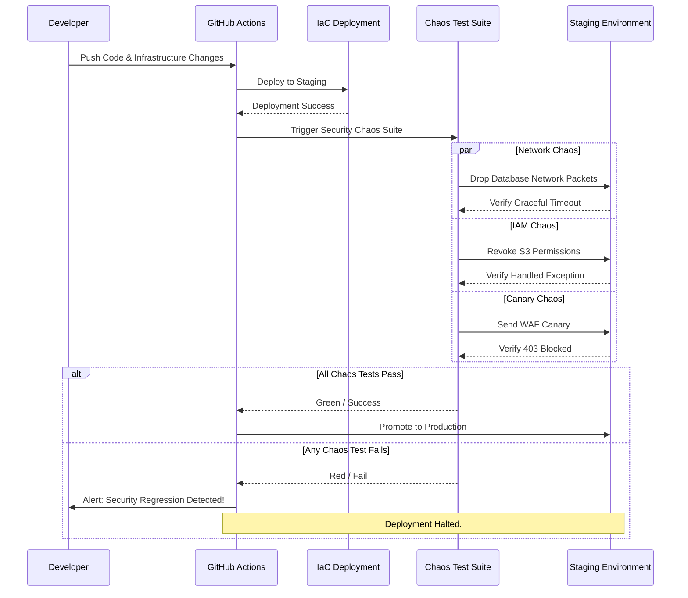

# Continuous Chaos in CI/CD

## 1. The Concept (ELI5)

Imagine you test the smoke detectors in your house once a year. If they break the day after you test them, you live without smoke detectors for 364 days. 

In software, checking your security posture once a quarter during a penetration test leaves you exposed for 89 days. **Continuous Security Chaos Engineering** means running these chaos experiments automatically, every single day, or every time a developer pushes new code. 

By integrating chaos experiments into your CI/CD pipeline (Continuous Integration / Continuous Deployment), you ensure that no new code accidentally breaks your security controls. If a developer accidentally removes the WAF or modifies an IAM role to be too permissive, the Continuous Chaos pipeline will fail the build before it ever reaches production.

## 2. The Visual



## 3. The Code

How do we actually run these chaos tests in a pipeline? We can use GitHub Actions to trigger the chaos scripts we wrote in previous chapters against a staging environment.

### ❌ Vulnerable Pipeline (No Security Verification)

A typical deployment pipeline that only checks if the app compiles and passes unit tests, entirely ignoring infrastructure and security resilience.

**GitHub Actions (`deploy.yml`):**
```yaml
name: Deploy to Staging
on: [push]
jobs:
  deploy:
    runs-on: ubuntu-latest
    steps:
      - uses: actions/checkout@v3
      - name: Build
        run: npm run build
      - name: Deploy
        run: terraform apply -auto-approve
      # Stops here! Assumes everything is secure.
```

### ✅ Production-Ready Secure Code (Chaos-Driven Pipeline)

This pipeline deploys to staging, runs the Security Chaos Engineering suite to validate WAF, IAM, and Network resilience, and only promotes to production if the system proves it can handle the faults.

**GitHub Actions (`chaos-deploy.yml`):**
```yaml
name: Continuous Security Chaos
on:
  push:
    branches: [ main ]
  schedule:
    - cron: '0 2 * * *' # Also run nightly!

jobs:
  deploy-staging:
    runs-on: ubuntu-latest
    steps:
      - uses: actions/checkout@v3
      
      - name: Deploy Infrastructure (Staging)
        run: terraform apply -var="env=staging" -auto-approve
        
  security-chaos-engineering:
    needs: deploy-staging
    runs-on: ubuntu-latest
    steps:
      - uses: actions/checkout@v3
      
      - name: Install Python dependencies
        run: pip install requests boto3

      - name: 1. Run WAF Canary Payload Test
        run: python scripts/chaos/canary_waf_test.py --target https://staging.example.com
        
      - name: 2. Run Secret Rotation Chaos
        env:
          AWS_ACCESS_KEY_ID: ${{ secrets.CHAOS_AWS_KEY }}
          AWS_SECRET_ACCESS_KEY: ${{ secrets.CHAOS_AWS_SECRET }}
        run: python scripts/chaos/rotate_db_secret.py --env staging
        
      - name: 3. Verify Application Resilience
        run: python scripts/chaos/verify_app_health.py --target https://staging.example.com

  deploy-production:
    needs: security-chaos-engineering
    runs-on: ubuntu-latest
    steps:
      - name: Deploy to Production
        run: echo "Chaos tests passed! Promoting to Production."
        # terraform apply -var="env=prod" -auto-approve
```

## 4. The Guardrail

To ensure that teams don't bypass the chaos engineering tests in the CI/CD pipeline, we can use a tool like **OPA (Open Policy Agent) Conftest** to enforce that the GitHub Actions workflow file always includes the `security-chaos-engineering` job before the `deploy-production` job.

**Rego Guardrail (`pipeline-policy.rego`):**
```rego
package pipeline.chaos

# Deny if 'deploy-production' exists but doesn't depend on 'security-chaos-engineering'
deny[msg] {
    prod_job := input.jobs["deploy-production"]
    
    # Check if 'needs' is missing or doesn't contain the chaos job
    not depends_on_chaos(prod_job)
    
    msg := "Security Violation: deploy-production MUST depend on security-chaos-engineering. Do not bypass the chaos tests!"
}

depends_on_chaos(job) {
    # If needs is a string
    job.needs == "security-chaos-engineering"
}

depends_on_chaos(job) {
    # If needs is an array
    job.needs[_] == "security-chaos-engineering"
}
```

By enforcing this guardrail at the repository level, you mathematically guarantee that no code goes to production without successfully surviving your Security Chaos Engineering experiments.
