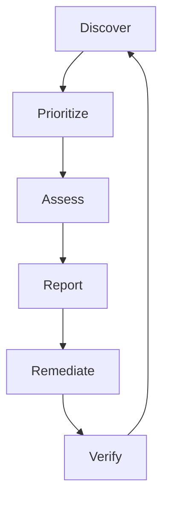

# 01 - Introduction

## The Vulnerability Management Lifecycle

Vulnerability management is not a point-in-time activity; it is a continuous, iterative lifecycle designed to systematically reduce an organization's attack surface. 

### 1. Discover
Before you can secure your environment, you must know what exists. This phase involves continuous asset inventory and vulnerability scanning to identify hardware, software, and the vulnerabilities they contain.

### 2. Prioritize
Modern environments produce thousands of vulnerability alerts. The prioritization phase contextualizes these findings using threat intelligence, asset criticality, and exploitability metrics to determine which vulnerabilities pose actual risk.

### 3. Assess
Once prioritized, the security team assesses the feasible impact and the context of the vulnerability within the specific environment. A CVSS 9.8 in an isolated, air-gapped lab has a different actual risk than a CVSS 7.5 on a public-facing web server.

### 4. Report
Actionable reports are generated and routed to the appropriate stakeholders (e.g., IT operations, DevOps, or system owners). Dashboards are updated to reflect the current security posture.

### 5. Remediate
This is the action phase. Remediation can involve:
- **Patching**: Updating the software to a secure version.
- **Mitigating**: Applying compensating controls (like a WAF rule) if a patch is unavailable or cannot be deployed immediately.
- **Accepting**: Formally acknowledging the risk if remediation is impossible or cost-prohibitive (requires a formal risk exception).

### 6. Verify
The loop closes with verification. Scanners or manual checks validate that the remediation was successful and that the vulnerability no longer exists.

---

## Traditional Scanning vs. Risk-Based Vulnerability Management (RBVM)

### The Problem with Traditional Scanning
Traditional vulnerability management often relies on a "whack-a-mole" approach based purely on CVSS severity:
- **Alert Fatigue**: Scanners generate reports with thousands of "Critical" and "High" findings.
- **Lack of Context**: A CVSS score measures technical severity, not true risk. It assumes the worst-case scenario.
- **Resource Drain**: Teams waste time patching high-CVSS vulnerabilities that have no active exploit, while missing lower-CVSS vulnerabilities that are actively being used in ransomware campaigns.

### The RBVM Shift
Risk-Based Vulnerability Management (RBVM) shifts the focus from fixing *everything* to fixing *what matters most*. 

| Feature | Traditional Vulnerability Management | Risk-Based Vulnerability Management (RBVM) |
|---------|--------------------------------------|--------------------------------------------|
| **Driver** | Compliance / CVSS Score | True Risk / Exploitability |
| **Data Sources** | Scanner output | Scanner + Threat Intel + Asset Criticality |
| **Goal** | Patch all High/Critical vulnerabilities | Mitigate the greatest business risks first |
| **Efficiency** | Low (wastes effort on non-exploited CVEs)| High (focuses on actively exploited CVEs) |

RBVM relies heavily on modern metrics like **EPSS (Exploit Prediction Scoring System)** and catalogs like the **CISA KEV (Known Exploited Vulnerabilities)** to filter the noise and highlight imminent threats.
