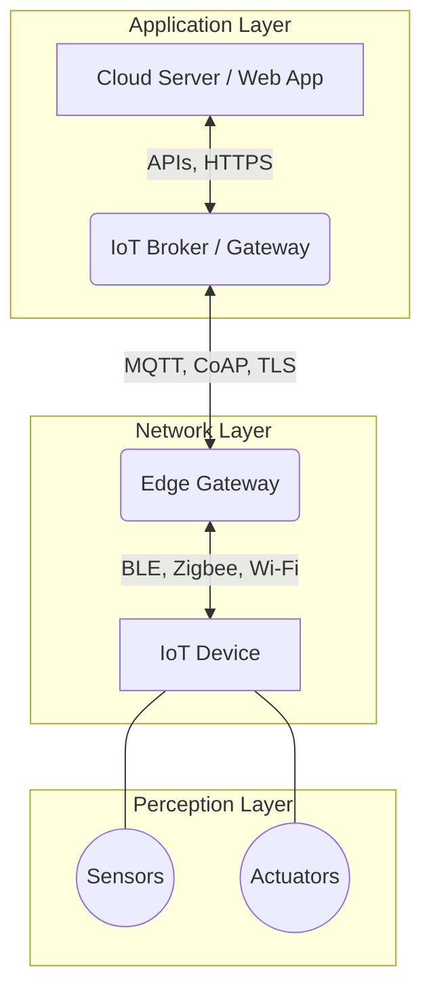

# 01. Introduction to IoT Architecture & Attack Surface

The Internet of Things (IoT) ecosystem encompasses a massive web of physical devices—sensors, actuators, smart home appliances, industrial controllers—that connect to the internet to collect and share data.

Securing these systems requires a holistic approach because an IoT environment spans hardware, embedded software (firmware), wireless protocols, and cloud backends.

> [!TIP]
> **Industry Best Practice:** Always align this domain with standard frameworks like OWASP, NIST, or CIS benchmarks for optimal security posture.

## 🏗️ IoT Architecture Layers

A typical IoT system is conceptualized into three primary layers:

1. **Perception Layer (Edge/Device Layer)**
   - **Role:** Interacts with the physical environment via sensors (temperature, motion) and actuators (motors, switches).
   - **Components:** Microcontrollers (MCU), System-on-Chip (SoC), memory (Flash, EEPROM).
   - **Security Risks:** Physical tampering, hardware interface exploitation (UART, JTAG), firmware extraction, side-channel attacks.

2. **Network Layer (Communication Layer)**
   - **Role:** Transmits data from the perception layer to the processing/application layer. 
   - **Components:** Gateways, routers, protocols (Wi-Fi, Bluetooth Low Energy, Zigbee, LoRaWAN, Cellular).
   - **Security Risks:** Eavesdropping, Man-in-the-Middle (MitM) attacks, protocol spoofing, replay attacks, lack of transport encryption.

3. **Application Layer (Cloud/Processing Layer)**
   - **Role:** Processes data, manages devices, and provides user interfaces (mobile apps, web dashboards).
   - **Components:** Cloud servers, databases, IoT brokers (MQTT, CoAP), APIs.
   - **Security Risks:** Insecure APIs, weak authentication, data breaches, insecure cloud storage, compromised Over-The-Air (OTA) update servers.

## 🛠️ The Hardware Attack Surface

Unlike traditional servers safely locked in a data center, IoT devices often reside in untrusted, physical environments (e.g., smart meters on a wall). Attackers with physical access can target several hardware debugging and communication interfaces:

### 1. UART (Universal Asynchronous Receiver-Transmitter)
- **What it is:** A serial communication protocol used heavily for device debugging and console access during development.
- **The Threat:** Developers often leave UART active in production. By connecting a USB-to-TTL serial adapter to exposed UART pins (TX, RX, GND), an attacker might get a root shell without a password, or access bootloader logs revealing memory maps and system architecture.

### 2. JTAG (Joint Test Action Group)
- **What it is:** An industry-standard interface used for testing printed circuit boards (PCBs) and low-level debugging.
- **The Threat:** JTAG allows direct control over the CPU core. An attacker can halt execution, read/write memory directly (bypassing OS-level protections), and extract firmware or cryptographic keys directly from RAM or flash memory.

### 3. SPI (Serial Peripheral Interface) & I2C (Inter-Integrated Circuit)
- **What it is:** Synchronous serial communication interfaces typically used for short-distance communication between the main microcontroller and peripheral chips (like EEPROM/Flash chips where firmware and secrets are stored).
- **The Threat:** Attackers can connect a logic analyzer or flash programmer (like a bus pirate or CH341A programmer) to the SPI/I2C bus to sniff data in transit (e.g., reading a key being loaded from EEPROM into the CPU) or directly dump the contents of an external flash memory chip containing the firmware.

## 🚨 Root Causes of IoT Vulnerabilities
- **Resource Constraints:** Small MCUs may lack the processing power for strong cryptography or TLS, leading to plaintext protocols.
- **Long Lifecycles & "Deploy and Forget":** Devices may remain active for 10+ years without firmware updates.
- **Hardcoded Secrets:** Developers embedding fixed passwords, API keys, and private keys directly into the firmware image to simplify cloud connectivity.

In the next chapter, we will explore how attackers exploit these physical interfaces and weak configurations to extract and analyze firmware.
