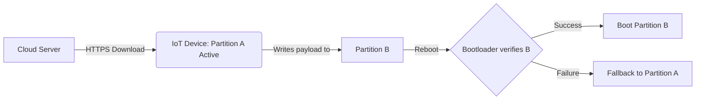

# 05. IoT Device Hardening & Secure OTA

Building on the hardware primitives from the previous chapter, we must implement robust operational security at the firmware and application level. The two most critical aspects are securing the Over-The-Air (OTA) update process and hardening the device's attack surface before deployment.

## 🔄 Secure Over-The-Air (OTA) Updates

OTA updates are essential for patching vulnerabilities in the field. However, a compromised OTA mechanism allows an attacker to push malware to thousands of devices simultaneously.

### The Anatomy of a Secure OTA Process

1. **Transport Encryption (TLS):** 
   Firmware must always be downloaded over an encrypted channel (HTTPS/MQTTS) to prevent Man-in-the-Middle (MitM) attacks.
2. **Firmware Signing (Authenticity & Integrity):**
   - Do not rely on checksums (MD5/SHA256) alone; attackers can recalculate hashes for malicious firmware.
   - The firmware payload must be digitally signed by the manufacturer using a strong asymmetric algorithm (e.g., ECDSA or RSA).
   - The device's bootloader or update daemon verifies the signature against a public key securely stored on the device (ideally in a hardware TrustZone/TPM).
3. **Anti-Rollback Protection:**
   - Attackers may attempt to downgrade a device to an older, vulnerable, but legitimately signed firmware version.
   - Implement monotonic counters (eFuses or secure storage) that increment with each firmware version. The bootloader must reject any firmware with a version number lower than the current counter.
4. **A/B Partitioning (Resilience):**
   - Instead of overwriting the active firmware (which bricks the device if power is lost), use A/B partitioning.
   - The device runs on Partition A. The OTA update is downloaded and written to Partition B. 
   - Upon reboot, the bootloader attempts to boot Partition B. If it fails (e.g., kernel panic, signature mismatch), it seamlessly falls back to Partition A.

## 🛡️ Surface Hardening Best Practices

Before a device leaves the factory, it must undergo a rigorous hardening process to remove development artifacts and close physical attack vectors.

### 1. Disable Hardware Debugging Interfaces
- **JTAG:** Disable JTAG via eFuses or physical trace cutting on production PCB spins.
- **UART:** Disable UART console access in the bootloader (U-Boot) and kernel (remove `console=ttyS0` from bootargs). If UART must remain for diagnostics, require strong authentication.

### 2. Remove Hardcoded Secrets
- Never embed static API keys, AWS credentials, or default passwords (e.g., `admin:admin`) into the firmware.
- Use unique, per-device credentials generated during the manufacturing provisioning process (e.g., injecting a unique X.509 certificate into each device).

### 3. Lockdown the Embedded OS
- **Minimal Firmware Image:** Strip out unnecessary binaries. Do not ship compilers (gcc), debuggers (gdb), or unnecessary networking tools (tcpdump, curl) in production firmware.
- **Root/Privilege Separation:** Do not run the main IoT application as `root`. Run processes as low-privileged users.
- **Filesystem Protections:** Mount the root filesystem as read-only (SquashFS). Only allow write access to specific data partitions (e.g., JFFS2/UBIFS) needed for logs or config updates.

By enforcing strict OTA procedures and systematically reducing the attack surface, you significantly increase the cost and complexity for an attacker attempting to compromise the device.
