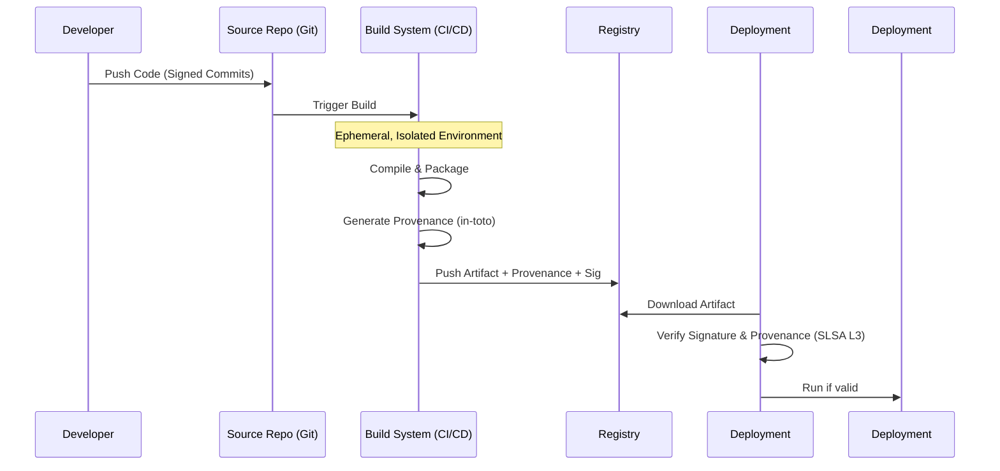

# Chapter 1: Understanding SLSA v1.0 Foundation

## 1. The Concept (ELI5)
Imagine you are eating at a high-end restaurant. You don't just care that the final dish looks good; you want to know that the ingredients were sourced from reputable farms, the chef washed their hands, and the kitchen passed a health inspection. 

**SLSA (Supply-chain Levels for Software Artifacts)** is the health inspection grading system for software. It ensures that the software you run was built securely, from trusted source code, in a secure environment, and hasn't been tampered with along the way. SLSA v1.0 defines a series of levels (Build L1 to L3) that grant increasing confidence that an artifact was not compromised during the build process. It focuses primarily on **Build Integrity** and **Provenance**—a fancy word for a receipt that proves exactly how the software was made.

## 2. The Visual


## 3. The Code: Implementing Build Security

### ❌ Vulnerable Code (No Integrity Checks)
Here is a standard, insecure script downloading and running an artifact without any SLSA verification.

**Go:**
```go
// Downloading and executing a binary without checking its provenance or signature.
cmd := exec.Command("curl", "-sSL", "http://example.com/malicious-binary", "-o", "app")
cmd.Run()
exec.Command("./app").Run()
```

**Python:**
```python
# Unsafe dynamic execution of unverified remote code
import urllib.request
response = urllib.request.urlopen('http://example.com/unverified_script.py')
exec(response.read())
```

**TypeScript (Node.js):**
```typescript
// Downloading and executing an unverified tarball
import { execSync } from 'child_process';
execSync('wget http://example.com/package.tgz && tar -xzf package.tgz && node package/index.js');
```

### ✅ Production-Ready Secure Code
Instead of blindly trusting artifacts, we use strict verification libraries (like `sigstore-go` or Sigstore's npm package) to verify the SLSA provenance before execution.

**Go:**
```go
package main

import (
	"log"
	"github.com/sigstore/sigstore-go/pkg/verify"
)

func verifyArtifact(artifactPath string) {
	// Initialize a verifier requiring SLSA provenance
	verifier, err := verify.NewSignedEntityVerifier(verify.WithProvenanceRequirement())
	if err != nil {
		log.Fatalf("Failed to initialize verifier: %v", err)
	}
	
	// Check the artifact against the Rekor transparency log and Fulcio root
	result, err := verifier.Verify(artifactPath)
	if err != nil {
		log.Fatalf("SECURITY ALERT: Artifact verification failed! %v", err)
	}
	log.Printf("Artifact verified successfully. Provenance valid: %v", result)
}
```

**Python:**
```python
import subprocess

def verify_and_run(artifact_name: str):
    # Using Cosign CLI wrapped securely in Python to verify SLSA provenance
    try:
        result = subprocess.run(
            ["cosign", "verify-attestation", "--type", "slsaprovenance", "--certificate-identity-regexp", ".*", "--certificate-oidc-issuer-regexp", ".*", artifact_name],
            capture_output=True, text=True, check=True
        )
        print("Provenance verified:", result.stdout)
    except subprocess.CalledProcessError as e:
        raise Exception(f"Verification failed: {e.stderr}")
```

**TypeScript:**
```typescript
import { verify } from '@sigstore/sign';

async function verifyPackage(tarballPath: string) {
    try {
        // Verify artifact using Sigstore's npm library
        await verify(tarballPath);
        console.log('Artifact signature and provenance verified securely.');
    } catch (error) {
        console.error('CRITICAL: Artifact failed verification.', error);
        process.exit(1);
    }
}
```

## 4. The Guardrail

To enforce SLSA provenance requirements in a cloud environment, we can use an OPA (Open Policy Agent) Rego policy that denies deployment if the SLSA Level is not met.

**Rego Policy (Enforce SLSA L3):**
```rego
package kubernetes.admission

# Deny deployment if SLSA provenance is missing or level is below L3
deny[msg] {
    input.request.kind.kind == "Pod"
    image := input.request.object.spec.containers[_].image
    
    # Hypothetical lookup to an attestation store
    attestation := check_attestation(image)
    
    not is_slsa_l3(attestation)
    
    msg := sprintf("Image %v does not meet SLSA Level 3 requirements. Deployment blocked.", [image])
}

is_slsa_l3(attestation) {
    attestation.predicateType == "https://slsa.dev/provenance/v1"
    attestation.predicate.buildDefinition.buildType != ""
    # SLSA L3 requires isolated, ephemeral build environments
    attestation.predicate.runDetails.builder.id != ""
}
```

**Terraform (Enforcing Binary Authorization in GCP):**
```hcl
resource "google_binary_authorization_policy" "slsa_enforcement" {
  project = var.project_id

  global_policy_evaluation_mode = "ENABLE"

  default_admission_rule {
    evaluation_mode  = "REQUIRE_ATTESTATION"
    enforcement_mode = "ENFORCED_BLOCK_AND_AUDIT_LOG"
    require_attestations_by = [
      google_binary_authorization_attestor.slsa_attestor.name
    ]
  }
}
```
