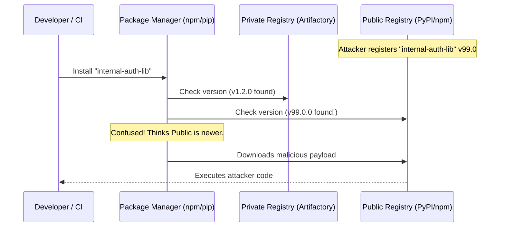

# Chapter 2: Dependency Confusion & Substitution Attacks

## 1. The Concept (ELI5)
Imagine you have an internal company phonebook. If you need to call "Bob from Accounting," you look him up in the company book. But what if someone prints a public phonebook, also includes a "Bob from Accounting" with a higher priority rating, and drops it on your desk? When you dial, you accidentally call an imposter.

**Dependency Confusion** happens when a package manager (like pip, npm, or gem) is configured to look for packages in both a private, internal registry and the public registry (like npmjs.com or PyPI). If an attacker registers a package on the public registry with the exact same name as your internal package, but assigns it a ridiculously high version number (e.g., `99.9.9`), the package manager might get confused and pull the malicious public version instead of your secure private one.

## 2. The Visual


## 3. The Code: Mitigating Dependency Confusion

### ❌ Vulnerable Code (Misconfigured Registries)

**Python (pip `requirements.txt` / `pip.conf`):**
```ini
# Vulnerable: specifying the extra-index-url causes pip to search PyPI as well as the private repo.
# If an attacker claims the package on PyPI, pip might install it.
[global]
index-url = https://pypi.org/simple
extra-index-url = https://my-company.com/artifactory/api/pypi/simple
```

**TypeScript/Node (npm `.npmrc`):**
```ini
# Vulnerable: No scope definition. All packages fallback to public registry if version is higher.
registry=https://registry.npmjs.org/
@mycompany:registry=https://npm.pkg.github.com
# But developers might just use `internal-util` without the scope!
```

**Go (`go env`):**
```bash
# Vulnerable: GOPRIVATE is not set, causing Go to attempt to fetch internal repos through the public proxy.
GOPROXY="https://proxy.golang.org,direct"
```

### ✅ Production-Ready Secure Code

**Python (Secure pip configuration):**
Instead of `extra-index-url`, use `--index-url` strictly for the private repo (which acts as a proxy/cache for public packages), or use Hash-Checking mode.
```ini
# Secure: Only point to the internal Artifactory/Nexus, which handles safe upstreaming.
[global]
index-url = https://my-company.com/artifactory/api/pypi/simple
```
*In requirements.txt, enforce hashes:*
```text
internal-auth-lib==1.2.0 --hash=sha256:d8c1...
```

**TypeScript/Node (Strict Scopes):**
Always use npm scopes (`@company/package`) and map ONLY that scope to the private registry. Prevent publishing internal packages externally.
```ini
# Secure .npmrc
# Map the specific scope to the private registry
@mycompany:registry=https://npm.pkg.github.com
# Enforce strict SSL
strict-ssl=true
```
```json
// package.json
{
  "name": "@mycompany/internal-auth-lib",
  "version": "1.2.0",
  "private": true // Prevents accidental public publishing
}
```

**Go (Secure GOPRIVATE):**
Instruct the Go toolchain to bypass the public proxy and checksum database for specific internal paths.
```bash
# Secure: Tell Go that github.com/mycompany/* is private
go env -w GOPRIVATE="github.com/mycompany/*"
```

## 4. The Guardrail

To automatically prevent dependency confusion in CI/CD, we can use Semgrep to detect vulnerable `pip.conf` or `requirements.txt` setups, and use infrastructure-as-code policies to enforce artifact proxying.

**Semgrep Rule (Detecting `--extra-index-url`):**
```yaml
rules:
  - id: pip-extra-index-url-dependency-confusion
    languages: [bash, generic]
    paths:
      include:
        - "pip.conf"
        - "requirements.txt"
        - "Dockerfile"
    message: "Using `--extra-index-url` can lead to dependency confusion attacks. Attackers can register a package with the same name on the public registry and pip will prioritize it. Use a private artifact repository proxy instead."
    severity: ERROR
    patterns:
      - pattern-regex: "(?i).*--extra-index-url.*"
```

**Terraform (AWS CodeArtifact config preventing public upstream routing for specific prefixes):**
```hcl
resource "aws_codeartifact_repository" "internal_repo" {
  repository = "company-internal"
  domain     = aws_codeartifact_domain.main.domain

  # Secure: Do not attach an external upstream like PyPI directly for internal prefixes
  external_connections {
    external_connection_name = "public:npmjs"
  }
}

# Policy to restrict publishing/fetching
resource "aws_codeartifact_repository_permissions_policy" "strict_policy" {
  repository  = aws_codeartifact_repository.internal_repo.repository
  domain      = aws_codeartifact_domain.main.domain
  policy_document = jsonencode({
    Version = "2012-10-17"
    Statement = [
      {
        Action = ["codeartifact:PublishPackageVersion"]
        Effect = "Allow"
        Principal = { AWS = var.ci_role_arn }
        Resource = "*"
        # Ensure packages must match strict internal naming conventions
        Condition = {
          StringLike = { "codeartifact:Package" : "@mycompany/*" }
        }
      }
    ]
  })
}
```
