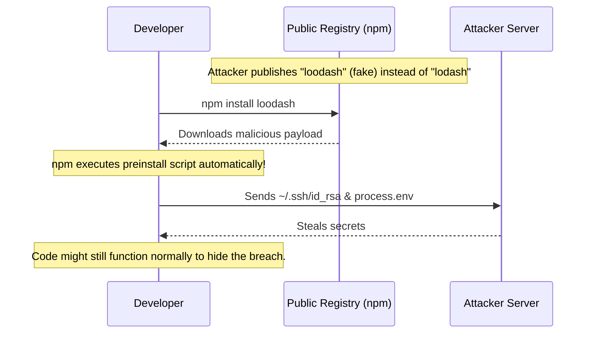

# Chapter 3: Typosquatting & Malicious Dependencies

## 1. The Concept (ELI5)
Imagine you are trying to buy a pair of "Nike" shoes online, but you accidentally type "Nkie.com" and buy from a fake store that steals your credit card. 

**Typosquatting** in the software supply chain works exactly the same way. Attackers register packages with names that are very similar to popular libraries (e.g., `reqeusts` instead of `requests`, or `react-dom` instead of `react-dom`). If a developer makes a typo during `npm install` or `pip install`, they download the malicious package. These packages often contain installation scripts that instantly execute malware, steal SSH keys, or exfiltrate environment variables.

## 2. The Visual


## 3. The Code: Preventing Malicious Execution

### ❌ Vulnerable Code (Blindly Installing Packages)
When you run install commands without verifying or locking, you expose yourself to executing malicious lifecycle scripts.

**Node.js/npm:**
```bash
# Vulnerable: Running install on an untrusted package triggers its preinstall scripts.
npm install expresss # Typo! Runs malicious script.
```

**Python:**
```bash
# Vulnerable: pip automatically runs setup.py which can execute arbitrary code.
pip install reqeusts
```

**Go:**
```go
// Vulnerable: Importing a misspelled module path
import (
    "github.com/go-redis/rediss/v8" // Typo! Hacker repo.
)
```

### ✅ Production-Ready Secure Code
Always lock dependencies using exact hashes, disable automated scripts if not needed, and use automated scanners (like OSV-Scanner).

**Node.js/npm:**
Disable scripts globally or locally to prevent `preinstall` or `postinstall` malware from executing automatically.
```bash
# Secure: Ignore scripts during installation
npm install --ignore-scripts lodash
```
Or enforce it in `.npmrc`:
```ini
ignore-scripts=true
```

**Python (Poetry / strict hashes):**
Use tools like Poetry or `pip-tools` that generate explicit hashes for everything.
```toml
# pyproject.toml using Poetry ensures strict locking and hashes
[tool.poetry.dependencies]
python = "^3.9"
requests = "2.28.1" # Exact version, Poetry will hash check this in poetry.lock
```

**Go:**
Go modules inherently use `go.sum` to verify the cryptographic hash of the downloaded modules. Ensure `go.sum` is always committed and never bypassed.
```bash
# Validate modules against go.sum and the checksum database
go mod verify
```

## 4. The Guardrail

To prevent typosquatting and malicious packages, we implement tools that verify packages against known vulnerability databases (OSV) and statically analyze dependency files.

**Semgrep Rule (Enforcing `--ignore-scripts` in CI/CD pipelines):**
```yaml
rules:
  - id: npm-install-without-ignore-scripts
    languages: [bash, dockerfile]
    message: "Running `npm install` in CI/CD without `--ignore-scripts` can execute malicious post-install scripts from typosquatted packages. Always use `npm ci --ignore-scripts`."
    severity: WARNING
    patterns:
      - pattern-regex: 'npm (install|i|ci)\b(?!.*--ignore-scripts)'
```

**GitHub Actions (OSV-Scanner integration):**
Automatically scan for known malicious packages (often quickly flagged by the community) in every PR.
```yaml
name: OSV-Scanner
on: [push, pull_request]

jobs:
  scan:
    runs-on: ubuntu-latest
    steps:
      - uses: actions/checkout@v3
      - name: Run OSV-Scanner
        uses: google/osv-scanner-action/osv-scanner-action@v1.7.1
        with:
          # Scan the whole repository for vulnerable/malicious lockfiles
          scan-args: |-
            -r
            ./
```
