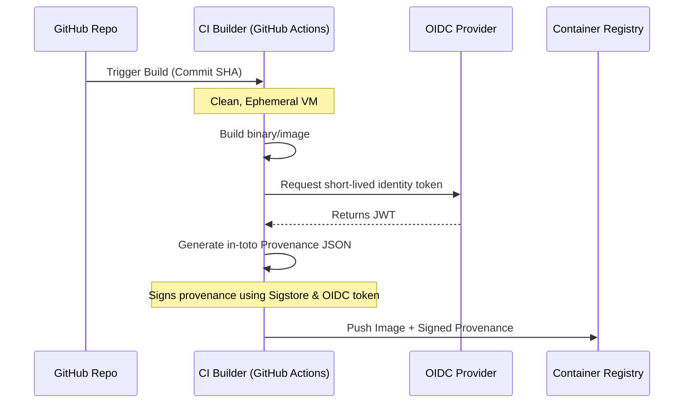

# Chapter 4: Build Integrity & Provenance (in-toto)

## 1. The Concept (ELI5)
Imagine buying a luxury watch. It comes with a Certificate of Authenticity that includes the serial number, the date it was assembled, the materials used, and the stamp of the master watchmaker. If you buy the watch in a dark alley without the certificate, it’s probably a fake.

**Build Provenance** is the Certificate of Authenticity for your software. Using the **in-toto** specification, provenance is a cryptographically signed document that states exactly *what* was built, *who* built it (e.g., GitHub Actions), *when* it was built, and *how* it was built (the exact commands and source code commit). Under SLSA v1.0, generating this provenance in a tamper-proof, ephemeral CI environment is essential to reach SLSA Build Level 3.

## 2. The Visual


## 3. The Code: Generating and Consuming Provenance

### ❌ Vulnerable Code (No Provenance)
A simple Docker build and push that provides zero cryptographic guarantee about how the image was built. If an attacker compromises the registry, they can simply overwrite `my-app:latest`.

**GitHub Actions (Vulnerable):**
```yaml
jobs:
  build:
    runs-on: ubuntu-latest
    steps:
      - uses: actions/checkout@v3
      - run: docker build -t my-registry.com/my-app:latest .
      - run: docker push my-registry.com/my-app:latest
```

### ✅ Production-Ready Secure Code
Using the SLSA GitHub Generator, we can automatically generate unforgeable, signed provenance for our builds. This leverages Sigstore's keyless signing and OIDC.

**GitHub Actions (Secure SLSA L3 Provenance Generation for Containers):**
```yaml
name: Build and Generate Provenance

on:
  push:
    tags:
      - 'v*'

permissions:
  contents: read
  id-token: write # Required for OIDC keyless signing
  packages: write

jobs:
  build:
    outputs:
      image: ${{ steps.image.outputs.image }}
      digest: ${{ steps.build.outputs.digest }}
    runs-on: ubuntu-latest
    steps:
      - uses: actions/checkout@v3
      - name: Log in to Registry
        uses: docker/login-action@v2
        with:
          registry: ghcr.io
          username: ${{ github.actor }}
          password: ${{ secrets.GITHUB_TOKEN }}
          
      - name: Build and push
        id: build
        uses: docker/build-push-action@v4
        with:
          push: true
          tags: ghcr.io/my-org/my-app:${{ github.sha }}

      - name: Output image
        id: image
        run: echo "image=ghcr.io/my-org/my-app" >> "$GITHUB_OUTPUT"

  # Use the official SLSA generator reusable workflow
  provenance:
    needs: [build]
    permissions:
      id-token: write # For signing
      packages: write # For attaching to registry
      actions: read   # For reading workflow run details
    uses: slsa-framework/slsa-github-generator/.github/workflows/generator_container_slsa3.yml@v1.9.0
    with:
      image: ${{ needs.build.outputs.image }}
      digest: ${{ needs.build.outputs.digest }}
      registry-username: ${{ github.actor }}
    secrets:
      registry-password: ${{ secrets.GITHUB_TOKEN }}
```

## 4. The Guardrail

Once provenance is generated, we must verify it before deployment. We can use `slsa-verifier` in CD pipelines or Kubernetes admission controllers.

**Rego Policy (Kyverno ClusterPolicy for Kubernetes to Enforce Provenance):**
This policy integrates with Kyverno to ensure that any container starting in the cluster has valid SLSA provenance verified by Cosign.

```yaml
apiVersion: kyverno.io/v1
kind: ClusterPolicy
metadata:
  name: check-slsa-provenance
spec:
  validationFailureAction: Enforce
  rules:
    - name: verify-in-toto-provenance
      match:
        any:
        - resources:
            kinds:
              - Pod
      verifyImages:
      - imageReferences:
        - "ghcr.io/my-org/*"
        attestations:
        - predicateType: https://slsa.dev/provenance/v1
          attestors:
          - entries:
            - keyless:
                subject: "https://github.com/my-org/my-repo/.github/workflows/build.yml@refs/tags/*"
                issuer: "https://token.actions.githubusercontent.com"
          conditions:
          - all:
            # Enforce that it was built from the main branch
            - key: "{{ regex_match('^refs/heads/main$', payload.predicate.buildDefinition.externalParameters.workflowInputs.ref) }}"
              operator: Equals
              value: true
```
