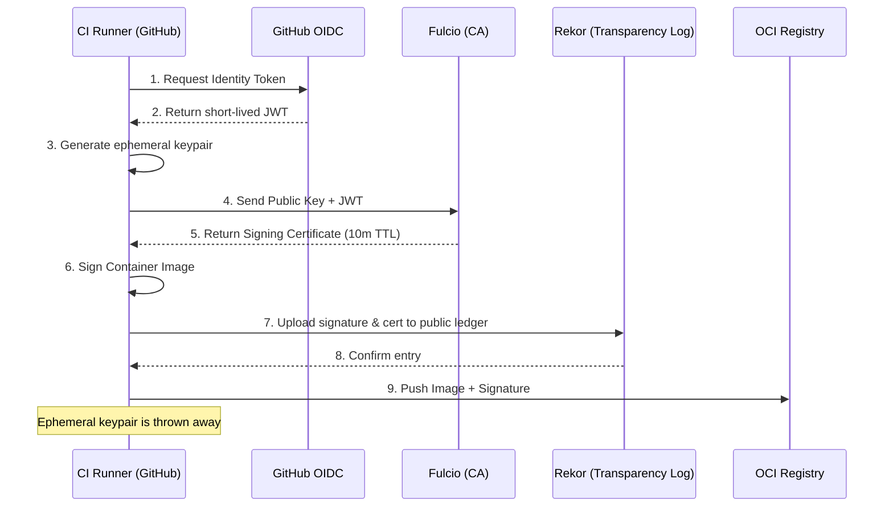

# Chapter 5: Artifact Signing with Sigstore & Cosign

## 1. The Concept (ELI5)
Imagine you receive a letter in the mail claiming to be from your bank. How do you know it’s really from them? If the letter has an official wax seal that only the bank possesses, you can trust it. But managing wax seals (PGP keys) is incredibly difficult—you might lose the stamp, or a thief might steal it. 

**Sigstore** is like a public notary that doesn't require you to manage long-lived wax seals. Instead of generating and protecting a GPG key for years, you prove your identity using your email or a CI/CD identity (like GitHub Actions OIDC). The notary issues a temporary certificate valid for just 10 minutes, you sign the artifact, and the notary publicly logs that the signing occurred. This process, known as **Keyless Signing**, makes securing software artifacts drastically easier and more secure. **Cosign** is the command-line tool used to interact with Sigstore.

## 2. The Visual


## 3. The Code: Implementing Keyless Signing

### ❌ Vulnerable Code (No Signatures)
Pushing an image without signing it allows Man-in-the-Middle (MitM) attackers or compromised registries to silently replace the image tag with malware.

```bash
# Anyone with registry access can overwrite this tag
docker build -t my-company/backend:v1 .
docker push my-company/backend:v1
```

### ✅ Production-Ready Secure Code (Keyless Signing)
Using Cosign within GitHub Actions to sign the artifact using OIDC.

**GitHub Actions (Keyless Signing with Cosign):**
```yaml
name: Build and Sign
on: [push]

permissions:
  packages: write
  id-token: write # CRITICAL: Required for OIDC and Keyless Signing

jobs:
  build-and-sign:
    runs-on: ubuntu-latest
    steps:
      - uses: actions/checkout@v3

      - name: Install Cosign
        uses: sigstore/cosign-installer@v3.1.1

      - name: Log in to Registry
        uses: docker/login-action@v2
        with:
          registry: ghcr.io
          username: ${{ github.actor }}
          password: ${{ secrets.GITHUB_TOKEN }}

      - name: Build and Push Image
        id: docker_build
        uses: docker/build-push-action@v4
        with:
          push: true
          tags: ghcr.io/my-org/backend:${{ github.sha }}

      - name: Sign the published Docker image
        env:
          COSIGN_EXPERIMENTAL: "true" # Required for older cosign versions, native in v2+
        run: |
          # Use the digest for immutable signing
          IMAGE="ghcr.io/my-org/backend@${{ steps.docker_build.outputs.digest }}"
          
          # Sign keylessly. Cosign automatically fetches the OIDC token, 
          # gets a cert from Fulcio, and writes to Rekor.
          cosign sign --yes ${IMAGE}
```

## 4. The Guardrail

To enforce that only images signed by your specific CI environment are deployed, you can use Kubernetes admission controllers like Kyverno or OPA Gatekeeper.

**Rego Policy (Gatekeeper for Cosign Verification):**
While Gatekeeper often uses the `external-data` feature for Cosign, many use Kyverno directly for its native Cosign support. Here is the Kyverno equivalent which serves as a robust guardrail.

```yaml
apiVersion: kyverno.io/v1
kind: ClusterPolicy
metadata:
  name: verify-image-signatures
spec:
  validationFailureAction: Enforce
  background: true
  rules:
    - name: check-image-signature
      match:
        any:
        - resources:
            kinds:
              - Pod
      verifyImages:
      - imageReferences:
        - "ghcr.io/my-org/*"
        mutateDigest: true
        attestors:
        - entries:
          - keyless:
              # Ensure the certificate subject matches the specific workflow repo
              subject: "https://github.com/my-org/backend/.github/workflows/build.yml@refs/heads/main"
              issuer: "https://token.actions.githubusercontent.com"
```
