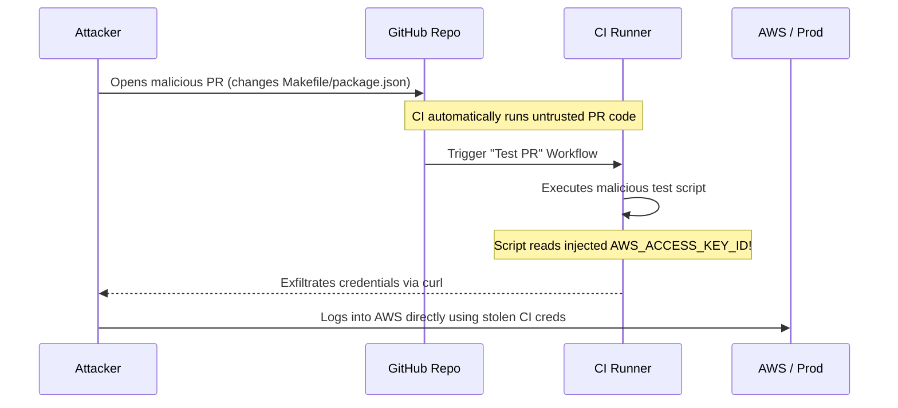

# Chapter 6: Securing CI/CD Pipelines

## 1. The Concept (ELI5)
Imagine your house has the strongest locks in the world (secure application code), but you leave the key under the doormat, and the doormat is guarded by a sleep-deprived teenager (a misconfigured CI/CD pipeline). Burglars won't bother picking the lock; they'll just take the key.

**CI/CD Pipeline Security** is about defending the automated machinery that builds and deploys your code. If attackers compromise your Jenkins server or GitHub Actions workflows, they can inject malicious code into every build, steal production deployment secrets, or bypass code review requirements. Common attacks include PwnRequests (malicious Pull Requests stealing CI secrets) and Poisoned Pipeline Execution (PPE).

## 2. The Visual


## 3. The Code: Defending Against CI Exploits

### ❌ Vulnerable Code (PwnRequest / Command Injection)
Running a workflow blindly on `pull_request` using `pull_request_target` or checking out code and evaluating untrusted input.

**GitHub Actions (Vulnerable `pull_request_target`):**
```yaml
name: PR Tests
# VULNERABLE: pull_request_target runs in the context of the base repo, 
# meaning it has access to SECRETS!
on: [pull_request_target]

jobs:
  build:
    runs-on: ubuntu-latest
    steps:
      # VULNERABLE: Checking out untrusted PR code in a privileged context
      - uses: actions/checkout@v3
        with:
          ref: ${{ github.event.pull_request.head.sha }}
          
      - name: Run Tests
        env:
          PROD_DB_PASSWORD: ${{ secrets.PROD_DB_PASSWORD }}
        # If the attacker altered the Makefile, they just stole the DB password.
        run: make test
```

### ✅ Production-Ready Secure Code (Least Privilege & OIDC)
Use `pull_request` (which runs in an isolated, unprivileged context without access to secrets). If you must deploy, use OIDC instead of long-lived secrets.

**GitHub Actions (Secure workflow using OIDC and Least Privilege):**
```yaml
name: Deploy to AWS
on:
  push:
    branches: [main]

permissions:
  # Block all permissions by default
  contents: read
  # Required for requesting the JWT
  id-token: write 

jobs:
  deploy:
    runs-on: ubuntu-latest
    environment: production # Requires manual approval in GitHub settings
    steps:
      - uses: actions/checkout@v3

      - name: Configure AWS Credentials
        uses: aws-actions/configure-aws-credentials@v2
        with:
          # Secure: No long-lived AWS_ACCESS_KEY_ID!
          # Uses OIDC to assume a role temporarily
          role-to-assume: arn:aws:iam::123456789012:role/GitHubActionsDeployRole
          aws-region: us-east-1

      - name: Deploy Infrastructure
        run: terraform apply -auto-approve
```

## 4. The Guardrail

To prevent malicious pipeline modifications or the inclusion of insecure third-party actions, we enforce branch protection rules and use OPA/Rego to scan pipeline definitions.

**Terraform (GitHub Branch Protection & Workflow Restrictions):**
```hcl
resource "github_branch_protection" "main" {
  repository_id = github_repository.core_api.name
  pattern       = "main"

  # Prevent force pushes and deletions
  allows_force_pushes = false
  allows_deletions    = false

  # Require PRs with approvals to prevent unilateral changes to workflows
  required_pull_request_reviews {
    required_approving_review_count = 2
    dismiss_stale_reviews           = true
    require_code_owner_reviews      = true
  }

  # Require status checks (CI must pass)
  required_status_checks {
    strict   = true
    contexts = ["ci/test"]
  }
}

# Restrict which Actions can be used in the repo to prevent compromised 3rd party actions
resource "github_actions_repository_permissions" "secure_actions" {
  repository      = github_repository.core_api.name
  allowed_actions = "selected"

  allowed_actions_config {
    github_owned_allowed = true
    verified_allowed     = true
    patterns_allowed     = [
      "aws-actions/*",
      "hashicorp/*",
      "sigstore/*"
    ]
  }
}
```
