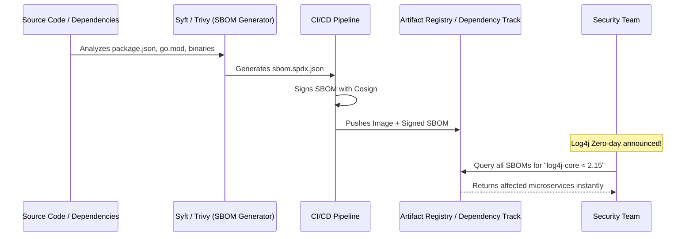

# Chapter 7: SBOM Generation & Validation

## 1. The Concept (ELI5)
Imagine buying a complex, pre-packaged meal at the grocery store, like a lasagna. If you have a severe peanut allergy, you need to read the ingredients list on the back of the box to ensure there are no peanuts or peanut oil. If the box has no ingredients list, it's unsafe to eat.

An **SBOM (Software Bill of Materials)** is the ingredients list for your software. It is a machine-readable document (usually in JSON or XML format) that lists every single open-source library, framework, and component that was compiled into your application, along with their exact versions. If a massive zero-day vulnerability (like Log4Shell) drops, an SBOM allows you to query your entire infrastructure in seconds to ask, "Are we running log4j version 2.14 anywhere?" instead of manually tearing apart containers to look for it.

The two major standards for SBOMs are **SPDX** (Linux Foundation) and **CycloneDX** (OWASP).

## 2. The Visual


## 3. The Code: Generating and Managing SBOMs

### ❌ Vulnerable Code (No visibility)
Deploying applications without tracking dependencies relies purely on ad-hoc vulnerability scanning, which often misses deeply nested transitive dependencies or compiled-in libraries.

### ✅ Production-Ready Secure Code (Generating SBOMs in CI)
We can use tools like Anchore's `syft` or Aqua's `trivy` to generate a CycloneDX or SPDX SBOM during the build, sign it, and attach it directly to the container registry alongside the image.

**GitHub Actions (Generating and Attaching an SBOM):**
```yaml
name: Generate SBOM
on: [push]

permissions:
  contents: read
  packages: write
  id-token: write

jobs:
  build-and-sbom:
    runs-on: ubuntu-latest
    steps:
      - uses: actions/checkout@v3

      - name: Log in to Registry
        uses: docker/login-action@v2
        with:
          registry: ghcr.io
          username: ${{ github.actor }}
          password: ${{ secrets.GITHUB_TOKEN }}

      - name: Build and Push Image
        id: build
        uses: docker/build-push-action@v4
        with:
          push: true
          tags: ghcr.io/my-org/api:${{ github.sha }}

      - name: Install Syft & Cosign
        run: |
          curl -sSfL https://raw.githubusercontent.com/anchore/syft/main/install.sh | sh -s -- -b /usr/local/bin
          # (Cosign install omitted for brevity)

      - name: Generate SBOM
        run: |
          IMAGE="ghcr.io/my-org/api@${{ steps.build.outputs.digest }}"
          
          # Generate SPDX JSON format SBOM
          syft ${IMAGE} -o spdx-json=sbom.spdx.json

      - name: Attach SBOM to Registry
        run: |
          # Use Cosign to attach the SBOM directly to the image in the OCI registry
          cosign attach sbom --sbom sbom.spdx.json ${IMAGE}
          
      - name: Sign the Image and the SBOM
        env:
          COSIGN_EXPERIMENTAL: "true"
        run: |
          cosign sign --yes ${IMAGE}
          
          # Get the digest of the attached SBOM
          SBOM_DIGEST=$(cosign download sbom ${IMAGE} | sha256sum | awk '{print $1}')
          # Sign the SBOM itself
          cosign sign --yes ghcr.io/my-org/api@sha256:${SBOM_DIGEST}
```

## 4. The Guardrail

Generating an SBOM is only half the battle; you must enforce its existence and validate its contents against known CVEs.

**Rego Policy (Enforce SBOM Attachment via Conftest):**
You can write a policy to ensure an SBOM was attached to the repository artifacts before deployment.

```rego
package sbom.enforcement

# Deny if the container image does not have an attached SBOM reference in its annotations/metadata
deny[msg] {
    input.kind == "Deployment"
    container := input.spec.template.spec.containers[_]
    
    # In a real environment, this would query a registry API or a metadata store like Grafeas
    not has_sbom_attached(container.image)
    
    msg := sprintf("Container image %v does not have an attached SBOM. Deployment blocked.", [container.image])
}

has_sbom_attached(image) {
    # Stub: check registry metadata for an attached sbom artifact
    # e.g., cosign verify-attestation --type cyclonedx
    metadata := fetch_registry_metadata(image)
    metadata.has_sbom == true
}
```

**Continuous Validation (Dependency-Track):**
Instead of static IaC checks, a robust architecture uploads the SBOM to an OWASP Dependency-Track server via API.
```bash
# Push SBOM to Dependency-Track for continuous CVE monitoring
curl -X "POST" "https://dtrack.mycompany.com/api/v1/bom" \
     -H 'Content-Type: multipart/form-data' \
     -H "X-Api-Key: $DTRACK_API_KEY" \
     -F "projectName=CoreAPI" \
     -F "projectVersion=${{ github.sha }}" \
     -F "bom=@sbom.spdx.json"
```
