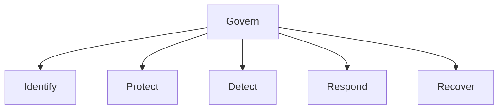

# 01 - Introduction to NIST CSF 2.0

## The Evolution of the Framework
The NIST Cybersecurity Framework (CSF) 2.0 represents a significant update to the seminal cybersecurity guidance originally designed for critical infrastructure. It has evolved to support organizations of all sizes and sectors, introducing the **GOVERN** function to emphasize that cybersecurity risk is a major source of enterprise risk.

## The Six Core Functions
NIST CSF 2.0 is organized into six core functions, providing a high-level, strategic view of the lifecycle of an organization's management of cybersecurity risk:

1. **GOVERN (GV):** The organization's cybersecurity risk management strategy, expectations, and policy are established, communicated, and monitored.
2. **IDENTIFY (ID):** The organization’s current cybersecurity risk is understood (assets, suppliers, and related risks).
3. **PROTECT (PR):** Safeguards are used to manage the organization’s cybersecurity risks and secure assets.
4. **DETECT (DE):** Possible cybersecurity attacks and compromises are found and analyzed.
5. **RESPOND (RS):** Actions are taken regarding a detected cybersecurity incident.
6. **RECOVER (RC):** Assets and operations affected by a cybersecurity incident are restored.

## Implementation Tiers
Tiers describe the degree to which an organization's cybersecurity risk management practices exhibit the characteristics defined in the Framework.
- **Tier 1 (Partial):** Ad-hoc, reactive risk management.
- **Tier 2 (Risk Informed):** Risk management practices are approved by management but not established as organizational-wide policy.
- **Tier 3 (Repeatable):** Formal policies exist and are consistently enforced.
- **Tier 4 (Adaptive):** Continuous improvement based on advanced technologies and predictive indicators.

## Framework Profiles
Profiles are a customization of the Core for a specific organization. They align the Framework Core with business requirements, risk tolerance, and resources.
- **Current Profile:** Indicates the cybersecurity outcomes currently being achieved.
- **Target Profile:** Indicates the outcomes needed to achieve the desired cybersecurity risk management goals.
Comparing the Current and Target Profiles reveals gaps to be addressed to meet cybersecurity risk management objectives.
