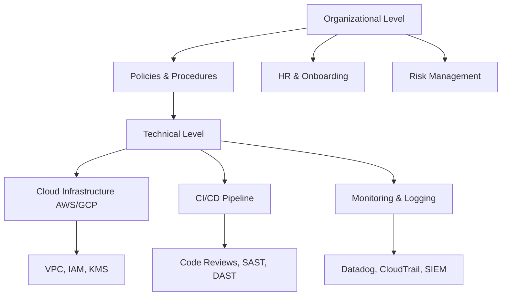

# 01 - Introduction to SOC 2

## 🧠 Theory and Core Concepts

SOC 2 (System and Organization Controls 2) is a voluntary compliance standard for service organizations, developed by the American Institute of CPAs (AICPA). It specifies how organizations should manage customer data.

### SOC 2 Type 1 vs. Type 2

- **SOC 2 Type 1:** Evaluates the design of security processes and controls at a *specific point in time*. It answers: "Did the company design good security controls as of today?"
- **SOC 2 Type 2:** Evaluates the *operating effectiveness* of these controls over a period of time (typically 3 to 12 months). It answers: "Did the company actually follow their security controls consistently over the last 6 months?"

> [!NOTE] 
> Startups often begin with a Type 1 report to quickly unblock sales, then immediately start the observation period for a Type 2 report.

### The 5 Trust Services Criteria (TSC)

SOC 2 is based on five Trust Services Criteria. Only **Security** is strictly required, while the others are optional depending on your business model.

1. **Security (Common Criteria) - REQUIRED**
   - Protection against unauthorized access (logical and physical).
   - Firewalls, IAM, MFA, Intrusion Detection, WAF.
   
2. **Availability**
   - The system is available for operation and use as agreed.
   - Disaster Recovery, Backups, SLA monitoring, Load Balancing.

3. **Processing Integrity**
   - System processing is complete, valid, accurate, timely, and authorized.
   - QA procedures, data validation, error handling.

4. **Confidentiality**
   - Information designated as confidential is protected as agreed.
   - Encryption (in transit and at rest), strict access controls, NDA enforcement.

5. **Privacy**
   - Personal information is collected, used, retained, disclosed, and disposed of in conformity with the organization's privacy notice.
   - GDPR/CCPA alignment, consent management, data retention policies.

## 🏗 Architecture of a Compliant Organization

## 🌪 Threat Landscape & Root Causes of Audit Failures

Organizations fail SOC 2 audits (receive "qualified" or "adverse" opinions) primarily due to:
- **Offboarding failures:** Not terminating access for former employees within SLAs (e.g., 24 hours).
- **Change management gaps:** Code merged directly to `main` without PR approvals or testing.
- **Missing evidence:** Failing to take screenshots/logs of quarterly access reviews.
- **Misconfigured infrastructure:** Publicly accessible S3 buckets or unencrypted databases.
