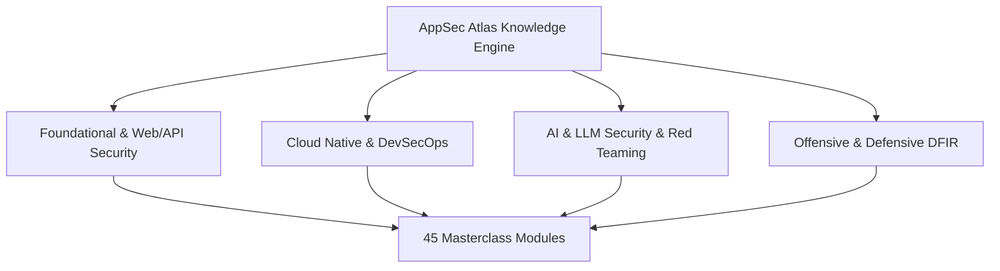

Today, we are thrilled to officially launch **AppSec Atlas** — a comprehensive, open-source security knowledge engine spanning **45 masterclass guides** and over **300 technical chapters** across 9 security domains.

Whether you are an Application Security Engineer, Cloud Architect, AI Researcher, or Software Developer, AppSec Atlas is built to map the entire modern software security landscape—with **zero fluff, pure engineering, and runnable code**.

{/* truncate */}

## Why We Built AppSec Atlas

For years, security knowledge has been fragmented across scattered OWASP cheat sheets, vendor whitepapers, outdated blog posts, and obscure academic research. Developers and security teams were left to piecemeal together defenses without a single, unified source of truth.

AppSec Atlas bridges this gap by providing:
1. **Multi-Language Implementation Code**: Side-by-side vulnerable ❌ vs secure ✅ implementations in Python, Node.js/TypeScript, Go, and Java Spring Boot.
2. **Runnable Vulnerability Labs**: Self-contained target microservices, automated exploit PoC harnesses, and unit-tested security refactors.
3. **Framework-Aligned Standards**: Direct alignment with OWASP Top 10 (Web, API, LLM), NIST AI 100-2, NIST SP 800-207 Zero Trust, and MITRE ATLAS™.

## Exploring the 9 Core Security Domains

AppSec Atlas organizes modern cybersecurity into 9 specialized domains:

1. **Foundational Security**: Core design patterns, Saltzer-Schroeder principles, AuthN/AuthZ, Cryptography, and Zero Trust.
2. **Web & API Security**: REST, GraphQL, gRPC, CORS/SOP mechanics, Frontend, and Mobile security.
3. **Cloud & DevSecOps**: Container & K8s security, Infrastructure as Code SAST, Secrets lifecycle, and CI/CD pipelines.
4. **AI & ML Security**: LLM Prompt Injection, RAG vector poisoning, Agentic AI, MCP Tool safety, and AI Red Teaming.
5. **Offensive Security**: CTF competition tactics, Web & Crypto exploits, Network attacks, and Social Engineering.
6. **Defensive Security & DFIR**: Incident Response, Digital Forensics (Disk/RAM/Artifacts), Malware Analysis, and SOC Operations.
7. **Specialized Technologies**: Browser Extension Manifest V3 security, IoT & Embedded device auditing, and Hardware security.
8. **Compliance & Privacy**: Technical implementation for GDPR, PCI-DSS v4.0, SOC 2 Type II, and ISO 27001.
9. **Hands-On Labs & PoCs**: Self-contained runnable vulnerability labs and automated exploit scripts.

## Get Involved & Contribute

AppSec Atlas is **100% open-source** and licensed under [Creative Commons Attribution 4.0 International (CC BY 4.0)](https://creativecommons.org/licenses/by/4.0/). 

- 🗺️ **Explore the Guides**: Start learning at [appsecatlas.com/docs/getting-started](/docs/getting-started).
- ⭐ **Star on GitHub**: Support the project on [GitHub](https://github.com/AnimeshShaw/AppSec-Atlas).
- 💬 **Join the Community**: Connect with contributors on [Discord](https://discord.gg/appsecatlas).
